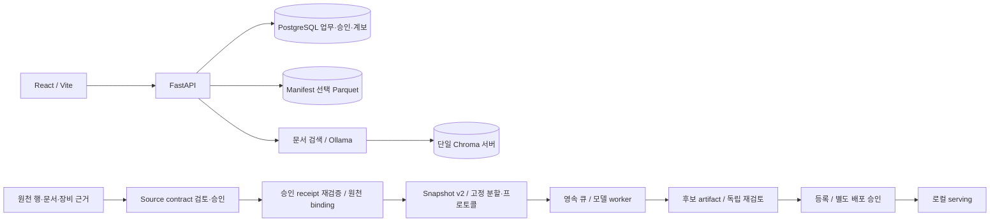

# 01. 시스템 아키텍처

기준일: 2026-10-08. 이 문서는 게시된 코드의 구성과 실행 경계를 설명한다. 문서 목록은 [docs 안내](README.md), 승인 원천과 모델 실행의 상세 계약은 [구현·검증 기록 82](../ocean-ai-platform/docs/82_SOURCE_CONTRACT_AND_MODEL_EXECUTION_RELEASE.md)를 참조한다.

## 구성과 데이터 흐름

플랫폼은 React 화면, FastAPI API, PostgreSQL 업무 기록, Parquet 원천 조회, 문서 검색, 승인된 모델 실행으로 구성된다. 화면이 표시하는 조회 결과와 학습에 사용할 수 있는 승인 데이터는 서로 다른 상태다.

| 계층 | 현재 구현 | 책임과 경계 |
|---|---|---|
| 화면 | React, TypeScript, Vite | 조회, 검토 상태, 승인 요청 및 운영 모델 상태 표시. API base는 기본 `/api`이며 Vite proxy를 사용한다. |
| API | FastAPI, Pydantic, SQLAlchemy | 요청 검증, 서버 Actor 인증, 업무 기록과 파일 의존성 검증. 라우터 구성은 [main.py](../ocean-ai-platform/backend/app/main.py)에 있다. |
| 업무 DB | PostgreSQL | Station/Sensor, Raw/Standard, 사건·라벨·Feature, Dataset, ApprovalHistory, ModelRegistry 및 승인 원천 binding. |
| 원천 조회 | PyArrow, DuckDB, manifest와 Parquet | 원천 문자·NULL·깊이 타입과 파일 계보를 보존한 조회. SQL 업무 테이블과 별도 저장소다. |
| 문서 검색 | 문서 contract, Ollama embedding, Chroma HttpClient | 문서·청크·모델 digest·dimension·parser/chunk 버전을 연결한다. 검색 유사도는 사건 인과관계나 인간 승인 점수가 아니다. |
| 실행 | SQLite 영속 큐, 별도 Python worker, 승인 artifact | 승인 데이터와 프로토콜을 재검증한 뒤 후보를 만든다. 학습 완료, 등록, 배포 승인은 각각 별도 단계다. |

[backend 의존성](../ocean-ai-platform/backend/requirements.txt), [frontend 구성](../ocean-ai-platform/frontend/package.json), [DB 모델](../ocean-ai-platform/backend/app/models/domain.py), [원천 binding 모델](../ocean-ai-platform/backend/app/models/source_observation_binding.py)을 기준으로 한다. `docker-compose.yml`은 PostgreSQL만 실행하며 API·화면·Ollama·Chroma·worker를 함께 기동하지 않는다.

## 조회 계층과 의미 식별자

`/api/lake/*`는 선택된 원천 manifest/Parquet을 조회한다. `/api/observations*`는 SQL Raw/Standard와 등록된 관측소 상태를 조회하는 기존 경로다. SQL 경로에 남아 있는 `SIMULATED` 레코드는 실제 승인 원천으로 간주하지 않는다. 한 경로의 행 수를 다른 경로의 관측 전체성이나 운영 준비도로 해석할 수 없다.

원천 관측소 코드, 원천 항목 코드, 파일·시트, 년월, 깊이의 값과 타입이 채널 검토 범위를 정한다. 표시용 관측망이나 생성된 `S_...` 채널 ID는 물리 장비 시리얼과 설치·교체 유효기간을 대신하지 않는다. 같은 이름의 시설, 역사 코드, BU/VBU 원천도 근거 없이 병합하지 않는다. [MDC 매핑](06_MDC_QUERY_MAPPING.md), [관측소 분류](08_MDC_STATION_CODE_MAPPING.md), [원천 검토 서비스](../ocean-ai-platform/backend/app/services/source_contract_review.py)를 참조한다.

## 승인 원천에서 모델까지

1. 원천 파일 SHA, 정확한 Parquet locator, 원문 값·시각·QC 문자, 물리 센서, 구간, 단위 변환, timezone, 수신·QC 가용시각을 source contract에 묶는다. 미확정 값은 DRAFT/PENDING에 남긴다.
2. 인증된 reviewer가 실제 원장에 결정한다. Agent가 packet의 `approved` 필드를 채우는 것으로 승인되지 않는다. Receipt의 SHA·Actor·packet·현재 결정과 원문 행을 [source authority](../ocean-ai-platform/backend/app/services/source_contract_authority.py)가 다시 검증한다.
3. 승인 receipt로 [ingest bridge](../ocean-ai-platform/backend/app/services/source_contract_snapshot.py)가 Raw/Standard와 `SourceObservationBinding`을 생성한다. 재실행은 같은 binding이면 멱등적이며, 원문·receipt 변경은 차단한다. 물리 기준정보가 없으면 검증된 승인 identity로 명시 등록해야 한다.
4. 사건·라벨·Feature 근거와 source receipt, SPLIT/EVALUATION/ACCEPTANCE 프로토콜의 불변 복사본을 Dataset snapshot v2에 동결한다. Feature 원천의 가용시각도 선언된 Feature 가용시각과 예측 origin 이하인지 확인한다. Source reviewer와 dataset reviewer는 서로 다른 승인 책임이다.
5. 고정 membership과 승인 split 전략으로 학습한다. 시간 분할에서 같은 센서 episode를 사용할 수 있는지는 승인 프로토콜에 따른다. 이벤트·원천 행·문서 family 재사용, embargo와 feature window 누수는 별도로 검사한다. Legacy v1을 승인 원천 v2로 자동 승격하지 않는다.
6. 별도 worker가 후보 artifact를 만들고, 독립 검토·등록·배포 승인을 거쳐 serving한다. [학습 운영](19_MLOPS_VERSION_AND_EVALUATION.md), [롤백](19_MLOPS_VERSION_AND_EVALUATION.md)을 참조한다.

## 실행 모드와 현재 운영 상태

`DATA_MODE=live`, `MDC_SYNC_ENABLED=false`, `AUTO_CREATE_TABLES=false`가 기본이다. Demo prototype 경로는 live에서 409로 막힌다. 승인·쓰기 권한은 [security.py](../ocean-ai-platform/backend/app/core/security.py)의 서버 `API_IDENTITIES`에 등록된 Actor가 결정한다. 임의 기본 관리자나 요청의 `user_id`로 권한을 만들지 않는다.

2026-10-08 13:09 KST 읽기 전용 운영 확인에서 source packet/decision/binding, ApprovalHistory, DatasetRegistry, ModelRegistry, RetrainingHistory, EventRegistry/EventEvidence, SensorAlias는 모두 0이었다. `API_IDENTITIES`도 비어 있다. 13:10:55 KST 추가 조회에서 기존 canonical worker는 RUNNING이며 승인 job이 없는 빈 큐를 대기한다. 공개 checkout이 실행 중이라는 뜻은 아니다. `/api/mlops/readiness`는 BLOCKED이고 `/api/mlops/serving/health`는 활성 로컬 모델이 없어 409다. 이는 실제 승인·학습 흐름을 아직 시작하지 않았다는 상태다. `mdc_sensor_catalog`는 모델 정의가 있으나 운영 테이블이 아직 없다.

72개 업무 범위는 `REPRESENTATION_BASELINE_SCOPE_PARTIAL`이다. 표현별 baseline 실행 경로를 구현한 상태이며, 업무별 선정·승인·운영 모델 72개가 완료된 상태가 아니다. 2026-10-07 AIR_PRES 500행은 원문/Parquet/locator가 대조되었지만 18,502개 미확정 오류로 승인이 차단되어 있다. 게시 tree의 backend 345 passed/1 skipped와 frontend build 통과는 코드 검증 결과이며 실제 원천 학습·운영 승인을 증명하지 않는다.
