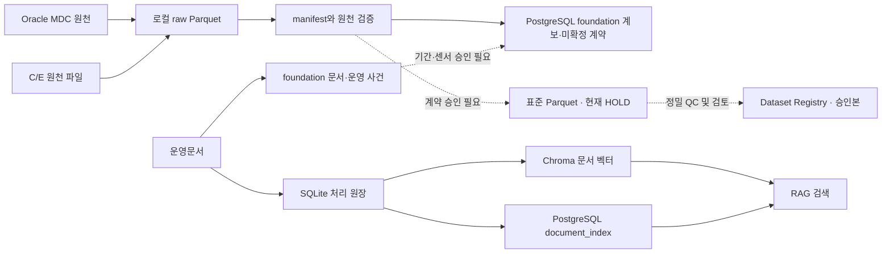

# 저장소 구성·경로·테이블·용량 운영 대장

작성일: 2026-10-05 (Asia/Seoul). DB 조회 UTC: 2026-10-05T13:10:58.973033+00:00, 파일 측정 UTC: 2026-10-05T13:09:32.433538+00:00.

> 2026-10-06 갱신 안내: 아래 용량·연결 건수는 당시 조사 스냅샷이다. D: 파일 레이크와 현재 웹 연결·실시간 확장 구조는 [67번 연관도 문서](67_DATA_TO_WEB_AND_REALTIME_ARCHITECTURE.md)를 우선 참조한다. 웹 소스는 현재 C:에서 실행하고, 신규 파일 레이크는 D:에서 조회한다.

## 종합 판단: 어디까지 연결되었는가

**2026-10-05 RDB 실제 적재 완료. 파일·Parquet·문서의 출처를 추적하는 연결은 구축했으나, 관측소–항목–물리 센서–유효기간–QC 근거가 모두 승인된 시계열은 아직 없다.** 적재 실행은 `foundation-20261005-v1`, 대상은 `localhost:5432/ocean_ai_db`의 `foundation` 스키마다. 이 문서의 제9절은 설계안에서 실제 구현·검증 결과로 갱신했다.

| 판단 항목 | 확인된 수준 | 업무상 의미 |
|---|---|---|
| 원천 → Parquet 계보 | 원천 위치/DB 객체 789,841건, Parquet 47,396건의 외래키·manifest 연결 | 어느 원천에서 나온 파일인지 추적 가능. 위치 건수는 고유 자료·실측 건수가 아님 |
| Parquet → 월별 관측 범위 | Parquet 원천 2,577개 중 7개에 월별 프로파일 연결; 2,570개는 미연결 | 전량 Parquet 보존과 전체 사용 가능 기간 산정은 별개. 현재 프로파일로 전체 레이크의 기간을 대표할 수 없음 |
| 관측소 식별 | 원천 이름공간별 식별자 4,154건 중 원천 관측소 메타데이터 보유 983건 | 나머지 3,171건은 식별자 보존용 기록. 실재 관측소 확정·서로 다른 원천의 동일 관측소 승인을 뜻하지 않음 |
| 항목·장비·단위 | 항목 계약 24,153건, 장비 944건, 장비 연결 후보 1,575건 | 단위 누락 5,160건; 물리 센서 및 승인 유효기간 연결 0건. 현재 코드가 과거 센서를 입증하지 않음 |
| 운영문서 → 사건 | 783개 문서 위치/456개 내용 해시, 선별한 인천 운영 사건 16건 | 전체 문서의 사건 추출 완료가 아님. 날짜·쪽·원문 근거는 조회 가능하나 교체 기간 계약은 미승인 |
| 관측·QC → 운영 사건 | 사건 발생일 포함 조회는 0건이나, 센서 사용 기간과 관측 기간의 교차 검증은 미구현 | 0건을 센서 기간 연결의 부재로 해석하면 안 됨. QC 검토 구간 1,644건의 인과 근거도 미확정 |
| 표준화·학습 사용 | 원천/관측소/항목/수심별 12,823개 시계열 요약 전부 HOLD | 동일 관측소·동일 기간과 센서·단위·시간대·QC 계약이 입증되기 전 다변량 결합·학습 승인 불가 |

테이블명은 저장 위치일 뿐 자료의 업무 의미나 시간 연결의 증거가 아니다. 예를 들어 `WEB_OBS_ST`에서 메타데이터로 확인된 곳은 순천만생태관·순천만용산입구 기상관측소와 순천만 수질관측소다. `WEB_OBS_VBU`에는 KOGA 관측점, 제주남부, 대한해협, 백령도, 항만·부이 등 여러 명칭이 함께 있다. **테이블 하나를 관측소 하나 또는 동일 센서 체계로 간주하지 않는다.**

이제 필요한 작업은 원천별 월별 프로파일 확대 → 관측소 식별자 대조 → 센서 설치·회수 기간의 증거 연결 → 단위·시간대·당시 QC 적용 규칙 검토 → 승인 표준화·QC 재실행이다. Foundation 등록과 현재 서비스 화면/API 연결도 별도다. 기존 앱은 `public` 테이블을 사용하며 이번 작업은 API를 새 스키마로 전환하지 않았다.

## 1. 실제 구성 요약

현재 구성은 **원격 Oracle 원천 RDB + 로컬 PostgreSQL 애플리케이션 RDB + 로컬 Parquet 파일 레이크 + Chroma 벡터 저장소 + SQLite 처리 원장**이다. PostgreSQL에서 별도 TimescaleDB 확장은 발견되지 않았다. 확인한 프로젝트 설정에는 S3/MinIO 버킷이나 별도 Object Storage 서비스가 없으며, 현재 레이크를 S3 Object Storage라고 부르지 않는다.

| 구분 | 실제 주소/경로 | 저장 정보·목적 | 측정 용량/상태 |
|---|---|---|---|
| 원천 RDB / Oracle | 119.195.114.103:31000/orcl | MDC 관측값·관측소·항목·장비 메타데이터 | OCEAN_WEB 할당 세그먼트 35,218,915,328 B / 32.800 GiB; RTDB/WRN 별도 |
| 업무 RDB / PostgreSQL | localhost:5432/ocean_ai_db | 메타데이터·관측 표·문서 색인·QC/Label/Registry | 1,487,158,631 B / 1.385 GiB (foundation 적재 후) |
| 시계열 저장 | Oracle 관측 테이블 / PostgreSQL 관측 테이블 / Parquet | 시간 컬럼을 가진 관계형·파일 저장; 전용 TSDB로 오인 금지 | TimescaleDB 미설치; 별도 InfluxDB 등은 확인 범위에서 미확인 |
| 파일 레이크 | C:\AI_Observation\data_lake\spool_2001_2026 | 원천 보존 Parquet·기존 자료·manifest·QC 근거 | 51,483,261,785 B / 47.948 GiB |
| Object Storage | 현재 S3/MinIO endpoint·bucket 미확인 | 향후 파일 객체 계층을 이전할 수 있으나 이번 조사에서 배포하지 않음 | 현재는 NTFS 로컬 경로 |
| 문서 Vector DB | C:\AI_Observation\ocean-ai-platform\backend\app\data\chroma_db | 문서 임베딩·유사도 검색 | 2,531,463,976 B / 2.358 GiB |
| 문서 처리 SQLite | C:\AI_Observation\ocean-ai-platform\backend\app\data\document_pipeline\ingestion.sqlite3 | 파일 상태·실행·오류·임베딩 캐시 | 1,146,298,368 B / 1.068 GiB + WAL/SHM |
| 업무 자동화 Vector DB | C:\AI_Observation\ocean-ai-platform\backend\chroma_db | ocean_reports_prod 별도 저장소 | 188,416 B / 0.000 GiB; 벡터 0건 |

GiB=1,073,741,824 bytes. 파일은 논리 길이 합계이며 파일시스템 할당 블록과 다르다. Oracle은 할당 세그먼트, PostgreSQL은 서버가 보고한 DB/테이블+인덱스 크기다. 이 수치들을 동일한 의미의 사용량으로 단순 합산하지 않는다. 부모 디렉터리와 하위 디렉터리의 크기도 중복 합산하지 않는다.



## 2. Oracle MDC: 원천 RDB

접속 비밀번호·토큰은 기록하지 않았다. 현재 세션의 스키마는 OCEAN_WEB, 서비스는 orcl이다. RTDB.DT와 WRN.T_WRN_TW_BUOY는 다른 소유자의 원천이다. 이름이 비슷한 T_WM_TW_BUOY와 혼동하지 않고 실제 조회된 객체명을 사용한다.

다음 행 수는 **2026-10-04 시작 원천 Parquet snapshot**이며 현재 Oracle 전체 COUNT를 다시 수행한 값이 아니다. NUM_ROWS/LAST_ANALYZED는 별도 통계값이다. 원천 테이블 할당량과 압축 Parquet 크기는 다르다.

| 객체 | Tablespace | TABLE 할당량 | 조회된 INDEX 할당량 | 추출 snapshot 행 | Parquet 용량 |
|---|---|---|---|---|---|
| OCEAN_WEB.TP_OBS_OC | RTDB_DATA | 65,536 B / 0.000 GiB | 0 B / 0.000 GiB | 72 | 2,980 B / 0.000 GiB |
| OCEAN_WEB.TP_OBS_SO | RTDB_DATA | 83,886,080 B / 0.078 GiB | 61,865,984 B / 0.058 GiB | 1,938,808 | 7,590,251 B / 0.007 GiB |
| OCEAN_WEB.WEB_OBS_BU | RTDB_DATA | 65,536 B / 0.000 GiB | 65,536 B / 0.000 GiB | 0 | 0 B / 0.000 GiB |
| OCEAN_WEB.WEB_OBS_ITEM_INFO | RTDB_DATA | 3,145,728 B / 0.003 GiB | 3,145,728 B / 0.003 GiB | 이번 전량 추출 대상 아님 | — |
| OCEAN_WEB.WEB_OBS_ST | RTDB_DATA | 352,321,536 B / 0.328 GiB | 486,539,264 B / 0.453 GiB | 8,593,175 | 22,694,619 B / 0.021 GiB |
| OCEAN_WEB.WEB_OBS_VBU | RTDB_DATA2 | 1,342,177,280 B / 1.250 GiB | 2,818,572,288 B / 2.625 GiB | 25,330,000 | 82,614,390 B / 0.077 GiB |
| OCEAN_WEB.WEB_OBS_VSC | RTDB_DATA | 309,329,920 B / 0.288 GiB | 0 B / 0.000 GiB | 7,088,040 | 46,076,261 B / 0.043 GiB |
| OCEAN_WEB.WEB_STATION | RTDB_DATA | 3,145,728 B / 0.003 GiB | 6,291,456 B / 0.006 GiB | 이번 전량 추출 대상 아님 | — |
| RTDB.DT | RTDB_DATA2 | 10,764,681,216 B / 10.025 GiB | 6,738,149,376 B / 6.275 GiB | 113,501,488 | 1,547,424,314 B / 1.441 GiB |
| RTDB.RT | RTDB_DATA2 | 444,596,224 B / 0.414 GiB | 134,217,728 B / 0.125 GiB | 이번 전량 추출 대상 아님 | — |
| WRN.T_WRN_TW_BUOY | WRN_TBS | 1,140,850,688 B / 1.062 GiB | 1,191,182,336 B / 1.109 GiB | 13,472,130 | 157,467,064 B / 0.147 GiB |

소유자별 할당 세그먼트(TABLE/INDEX/LOB 포함):

| Owner | 할당 세그먼트 합계 |
|---|---|
| OCEAN_WEB | 35,218,915,328 B / 32.800 GiB |
| RTDB | 16,781,737,984 B / 15.629 GiB |
| WRN | 2,459,762,688 B / 2.291 GiB |

OCEAN_WEB의 USER_TABLES 378개 전체 이름·통계 행 수·Tablespace·분석일은 `database-catalog.json → oracle.user_tables`, 세그먼트별 용량은 `oracle.segments`에 기록했다. 현재 읽을 수 있는 전체 datafile 합계는 114,357,174,272 B / 106.503 GiB이며 다른 스키마·SYSTEM·UNDO도 포함하므로 MDC 관측 데이터 용량으로 사용하지 않는다.

아래 경로는 **원격 Oracle 서버의 E: 경로**다. 이 PC의 `E:/백업/data/...`와 다른 위치다.

| Tablespace | 원격 서버 datafile | 파일 크기 |
|---|---|---|
| IEODO_TBS | E:\ORADATA\IEODO_TBS.DBF | 34,309,406,720 B / 31.953 GiB |
| NTMS_DATA | E:\ORADATA\NTMS_DATA.DBF | 104,857,600 B / 0.098 GiB |
| NTMS_INDX | E:\ORADATA\NTMS_INDX.DBF | 104,857,600 B / 0.098 GiB |
| RTDB_DATA | E:\ORADATA\RTDB_DATA.DBF | 11,261,706,240 B / 10.488 GiB |
| RTDB_DATA2 | E:\ORADATA\RTDB_DATA2.DBF | 34,319,892,480 B / 31.963 GiB |
| RTDB_DATA2 | E:\ORADATA\RTDB_DATA2_01.DBF | 4,638,900,224 B / 4.320 GiB |
| SDB_CNS_DATA | E:\ORADATA\SDB_CNS_DATA01.DBF | 5,368,709,120 B / 5.000 GiB |
| SDB_WORKS | E:\ORADATA\SDB_WORKS01.DBF | 2,147,483,648 B / 2.000 GiB |
| SIS_SIW_DATA | E:\ORADATA\SIS_SIW_DATA.DBF | 104,857,600 B / 0.098 GiB |
| SYSAUX | E:\APP\GREENBLUE\ORADATA\ORCL\SYSAUX01.DBF | 671,088,640 B / 0.625 GiB |
| SYSTEM | E:\APP\GREENBLUE\ORADATA\ORCL\SYSTEM01.DBF | 891,289,600 B / 0.830 GiB |
| TOIS_3D | E:\ORADATA\TOIS_3D.DBF | 209,715,200 B / 0.195 GiB |
| UNDOTBS1 | E:\APP\GREENBLUE\ORADATA\ORCL\UNDOTBS01.DBF | 9,762,242,560 B / 9.092 GiB |
| USERS | E:\APP\GREENBLUE\ORADATA\ORCL\USERS01.DBF | 7,861,698,560 B / 7.322 GiB |
| WRN_TBS | E:\ORADATA\WRN_TBS.DBF | 2,600,468,480 B / 2.422 GiB |

## 3. PostgreSQL: 업무 RDB와 관측 테이블

서버는 PostgreSQL 15.19이며 실제 public 테이블은 아래 목록과 같다. 데이터 디렉터리는 서버 내부 `/var/lib/postgresql/data`다. `docker-compose.yml`은 `postgres:15`, `5432:5432`, `pgdata:/var/lib/postgresql/data`를 선언한다. Docker API 접근이 거부되어 실제 Docker volume 이름/Mountpoint와 Windows VHDX 경로는 확인하지 못했다. Compose 선언을 실제 mount 확인으로 대체하지 않는다.

관측용 `timestamp_utc`/`timestamp_kst` 컬럼과 인덱스가 있지만 그것만으로 전용 시계열 DB가 되는 것은 아니다. 이번 DB의 확장은 plpgsql만 있으며 TimescaleDB hypertable·압축·retention job은 확인되지 않았다.

최초 조사에서는 일부 테이블의 정확 COUNT를 수행하지 않아 `미조회`로 표시했었다. 이는 테이블의 용도·존재 미확인이 아니라 조사 미실시였다. 2026-10-05T14:24:11.993536+00:00에 public 43개 테이블을 읽기 전용으로 모두 COUNT하여 아래 행 수를 갱신했다. 크기는 이전 조사값이다. 추정 통계의 0을 빈 테이블의 증거로 사용하지 않았다.

| 테이블(public) | 정확 행 수 | 테이블+TOAST | 인덱스 | 합계 | 목적 |
|---|---|---|---|---|---|
| agent_task_approvals | 0 | 8,192 B | 16,384 B | 24,576 B | 에이전트 작업 승인 |
| ai_label | 0 | 8,192 B | 32,768 B | 40,960 B | 검토·승인 대상 Label |
| ai_prediction_result | 0 | 8,192 B | 32,768 B | 40,960 B | 예측 결과 |
| ai_reports | 0 | 8,192 B | 8,192 B | 16,384 B | AI 보고서 |
| alert | 0 | 8,192 B | 8,192 B | 16,384 B | 알림 |
| approval_history | 0 | 8,192 B | 16,384 B | 24,576 B | 승인 이력 |
| audit_log | 0 | 8,192 B | 16,384 B | 24,576 B | 감사 로그 |
| automation_test_result | 0 | 8,192 B | 8,192 B | 16,384 B | 자동화 검증 결과 |
| daily_inspection_report | 0 | 8,192 B | 8,192 B | 16,384 B | 일일 점검 보고서 |
| daily_situation_report | 0 | 8,192 B | 8,192 B | 16,384 B | 일일 상황 보고서 |
| data_lake_stat | 1 | 16,384 B | 81,920 B | 98,304 B | 레이크 요약 캐시; 실제 manifest를 대체하지 않음 |
| dataset_membership | 0 | 8,192 B | 24,576 B | 32,768 B | 데이터셋 구성 관측 연결 |
| dataset_registry | 0 | 8,192 B | 16,384 B | 24,576 B | 데이터셋 버전·분할·등록 |
| document_index | 245,036 | 490,799,104 B | 41,820,160 B | 532,619,264 B | 문서 청크 텍스트·원천 위치·임베딩 버전 메타데이터 |
| event_evidence | 0 | 8,192 B | 98,304 B | 106,496 B | 이벤트와 문서/관측 근거 연결 |
| event_registry | 0 | 8,192 B | 16,384 B | 24,576 B | 이벤트 기본정보 |
| feature_definition | 9 | 16,384 B | 16,384 B | 32,768 B | 특징 정의 |
| feature_provenance | 0 | 8,192 B | 8,192 B | 16,384 B | 특징 원천 계보 |
| feature_value | 0 | 8,192 B | 8,192 B | 16,384 B | 특징 값 |
| label_review_snapshot | 0 | 8,192 B | 16,384 B | 24,576 B | Label 검토 시점 스냅샷 |
| mdc_item_mapping | 65 | 49,152 B | 49,152 B | 98,304 B | MDC 항목→표준 변수 매핑 후보 |
| model_registry | 0 | 8,192 B | 24,576 B | 32,768 B | 모델 버전 등록 |
| observation_imputation | 0 | 8,192 B | 40,960 B | 49,152 B | 보간 결과 |
| observation_raw | 13,621 | 7,380,992 B | 8,847,360 B | 16,228,352 B | 애플리케이션 관측 입력; 이번 조회는 SIMULATED 태그 자료 |
| observation_standard | 4,074 | 819,200 B | 1,548,288 B | 2,367,488 B | 기존 OBS-STD-1.0 결과; 신규 승인 레이크와 별개 |
| operation_log | 0 | 8,192 B | 32,768 B | 40,960 B | 운영·점검 이력 |
| qc_flag_history | 0 | 8,192 B | 40,960 B | 49,152 B | QC 플래그 변경 이력 |
| qc_rule_definition | 2 | 16,384 B | 16,384 B | 32,768 B | QC 규칙 정의 |
| qc_rule_result | 0 | 8,192 B | 65,536 B | 73,728 B | 행/시계열 QC 검사 결과 |
| quality_collection_report | 0 | 0 B | 8,192 B | 8,192 B | 품질·수집률 보고서 |
| report_generation_history | 0 | 8,192 B | 16,384 B | 24,576 B | 보고서 생성 이력 |
| report_registry | 0 | 8,192 B | 16,384 B | 24,576 B | 보고서 등록 |
| report_test_result | 0 | 8,192 B | 8,192 B | 16,384 B | 보고서 검증 결과 |
| retraining_history | 0 | 8,192 B | 24,576 B | 32,768 B | 재학습 이력 |
| retraining_pool | 0 | 8,192 B | 24,576 B | 32,768 B | 재학습 후보 |
| sensor_alias | 0 | 8,192 B | 24,576 B | 32,768 B | 센서/장비 별칭 연결 |
| sensor_metadata | 2 | 16,384 B | 65,536 B | 81,920 B | 센서 기본정보·설치/교정/교체일 |
| service_monitoring_log | 0 | 8,192 B | 8,192 B | 16,384 B | 서비스 모니터링 |
| spring_tide_monitoring_report | 0 | 8,192 B | 8,192 B | 16,384 B | 대조기 모니터링 보고서 |
| station_metadata | 323 | 131,072 B | 122,880 B | 253,952 B | 관측소 식별·위치·기준면 메타데이터 |
| test_automation_logs | 0 | 8,192 B | 24,576 B | 32,768 B | 테스트 실행 로그 |
| test_scenarios | 0 | 8,192 B | 16,384 B | 24,576 B | 테스트 시나리오 |
| weekly_tide_residual_report | 0 | 8,192 B | 8,192 B | 16,384 B | 주간 조위 잔차 보고서 |

ORM에는 있으나 이번 운영 DB에서 확인되지 않은 테이블: `mdc_sensor_catalog`. 모델 선언과 물리 테이블 존재는 별도다. 테이블별 실제 상대 파일 경로(`base/16384/...`)는 JSON에 기록했다. 관계 파일은 서버가 관리하므로 파일을 직접 편집·복사해 DB를 변경하지 않는다.

### 기존 관측값의 출처·승인 주의점

| source_system | 행 수 | 저장된 UTC 컬럼 최초 | 최종 |
|---|---|---|---|
| MDC_WEB_OBS_ST_SIMULATED | 714 | 2026-09-15 15:05:00 | 2026-09-18 02:30:00 |
| MDC_WEB_OBS_VBU_SIMULATED | 12907 | 2026-09-15 15:00:15 | 2026-09-23 03:10:45 |

위 기간은 저장된 컬럼값의 범위이며 원천 시간대 계약을 재승인한 결과가 아니다. source_system의 SIMULATED 표기를 보존하고 실제 MDC 원천 snapshot과 구분해야 한다.

| 표준화 버전 | 변수 | 원천 단위 | 저장 표준 단위 | 행 수 |
|---|---|---|---|---|
| OBS-STD-1.0 | TIDE | cm | cm | 212 |
| OBS-STD-1.0 | SALINITY | m | m | 1 |
| OBS-STD-1.0 | WAVE | m | m | 3861 |

`observation_standard`의 기존 4,074행은 현재 Foundation의 승인 표준 Parquet가 아니다. 특히 SALINITY에 m 단위가 저장된 1행을 발견했다. 단위·출처 재검증 전 학습 승인 근거로 사용할 수 없다. 이 조사에서는 기존 데이터 수정·삭제를 하지 않았다.

`dataset_registry`, `model_registry`, `ai_label`, `event_evidence`는 이번 정확 조회에서 0행이다. 원천 Parquet 완료와 Registry/Label 구축 완료를 구분한다. 설정된 test_ocean_ai_db 접속은 실패했고, 운영 서버의 DB 목록에는 ocean_ai_db와 postgres가 반환되었다. 운영 DB와 별도 SQLite test_ocean_ai.db 파일을 혼동하지 않는다.

## 4. Parquet 레이크: 로컬 파일 객체 계층

루트: `C:\AI_Observation\data_lake\spool_2001_2026`. 측정 전체 51,483,261,785 B / 47.948 GiB. 레거시 연도 파티션은 Parquet 93,649개, 37,936,503,424 B / 35.331 GiB다.

| 레이크 상대 경로 | 전체 파일 | Parquet 파일 | 디렉터리 논리 용량 | 목적 |
|---|---|---|---|---|
| raw/mdc_full_20261004 | 1703 | 1703 | 1,863,869,879 B / 1.736 GiB | Oracle 원천 컬럼 문자열 보존 |
| raw/monthly_spool_20261004 | 6192 | 6149 | 2,852,587,552 B / 2.657 GiB | 2023-01~2026-07 SQLPlus 원천·QC 문자열 보존 |
| raw/historical_raw_20261005 | 41838 | 39313 | 7,778,966,608 B / 7.245 GiB | E: 01_raw 열 순서/문자열 보존 |
| raw/reconciled_v1 | 231 | 231 | 18,414,996 B / 0.017 GiB | 22개 원천/관측소/항목 파일럿 |
| metadata/qc_pilot | 19 | 1 | 10,636,395 B / 0.010 GiB | QC 후보·근거; 승인 Label 아님 |
| metadata/standardized | 1 | 0 | 266 B / 0.000 GiB | HOLD manifest; 승인 Parquet 0개 |
| metadata/closeout_20261005_v1 | 38 | 0 | 831,951,069 B / 0.775 GiB | 원천 예외·미처리 대장·QC 근거 |

저장 구조:

```text
spool_2001_2026/
  year=YYYY/...                            기존 legacy Parquet; HOLD
  raw/mdc_full_20261004/<table>/part-*.parquet
  raw/monthly_spool_20261004/<source-key>/part-*.parquet
  raw/historical_raw_20261005/<source-key>/part-*.parquet
  raw/reconciled_v1/<source>/<item>/<YYYY-MM>.parquet
  metadata/raw/manifest.json               정규 원천 파일럿 선택
  metadata/standardized/manifest.json      HOLD, files=[]
  metadata/mdc_full_20261004/*.json         테이블별 원천 snapshot
  metadata/monthly_spool_20261004/*.json    파일별 해시·행 수·메타행 정산
  metadata/historical_raw_20261005/*.json   파일별 변환 원기록
  metadata/closeout_20261005_v1/
    source_family_catalog.json            정정 상태를 반영한 선택 카탈로그
    historical-effective-status.json      E: 0바이트 1,149개 정정본
    additional-empty-source-status.json   C: 빈 안내 파일 1개 추가 기록
    inventory-v2/                         최종 파일별 전체/미처리 대장
    structural-qc/                        원천 시각·결측·월별 건수
  metadata/storage_catalog_20261005/       최초 저장소 조사 근거
  metadata/rdb_foundation_20261005/        RDB 실제 적재·검증·시계열 연결 판단
```

세 신규 대용량 원천군은 zstd 압축 Parquet다. Oracle 컬럼은 native 의미를 추정하지 않고 문자열로 보존했고, 월별 자료는 원천 7개 필드와 행 유형을 보존했다. E: 헤더가 없는 자료는 field_001 등 위치 필드다. 스키마가 다른 원천을 무조건 합치지 않는다.

manifest에는 원천 경로/해시, 출력 경로/해시, 행 수, 처리 상태, 승인 보류 정보를 저장한다. 데이터 내용 해시·행 수 정산과 단위·시간대·센서·QC 의미 승인은 별도 검사다. E: 원기록의 RUNNING은 정정 카탈로그를 통해 확인하며 프로세스 생존을 추정하지 않는다.

파일명 spool_2001_2026은 관리 범위 이름이다. 2001~2026 연속 실측이나 모든 관측소의 사용 가능 기간을 보증하지 않는다. 원천군끼리 중복 가능성이 있으므로 행 수를 더해 고유 관측 수로 발표하지 않는다.

프로젝트 내부의 별도 `ocean-ai-platform/data_lake`도 남아 있다. 그 크기는 79,822,720 B / 0.074 GiB이며 통합 레이크 루트와 다르다. 실제 클라이언트는 경로와 계층별 manifest를 명시적으로 선택해야 한다.

## 5. Vector DB와 문서 처리 원장

### 문서 검색용 Chroma

영속 경로 `C:\AI_Observation\ocean-ai-platform\backend\app\data\chroma_db`, SQLite 본체 `1,359,204,352 B`, SQLite+벡터 색인 전체 2,531,463,976 B / 2.358 GiB. 컬렉션 6개, 저장된 embedding 레코드 총 268,433개다. 이 수는 문서 수가 아니라 벡터 레코드 수다.

설정 endpoint는 `http://127.0.0.1:8001`이다. 이번 TCP 확인 결과는 `UNREACHABLE_OR_REFUSED`이므로 파일 존재와 현재 검색 서비스 가동을 구분한다. 서버를 자동 기동하거나 색인을 재작성하지 않았다.

| 컬렉션 | 차원 | 영속 embedding 레코드 | 역할 |
|---|---|---|---|
| langchain | 768 | 4 | 이전 버전/기존 컬렉션; 자동 통합하지 않음 |
| ocean_reports | 1024 | 1786 | 이전 버전/기존 컬렉션; 자동 통합하지 않음 |
| ocean_semantic_beee17c3d47a699d | 1024 | 276 | 이전 버전/기존 컬렉션; 자동 통합하지 않음 |
| ocean_semantic_5dbe1270ea5e2061 | 1024 | 179 | 이전 버전/기존 컬렉션; 자동 통합하지 않음 |
| ocean_semantic_2058bb6e71a87288 | 1024 | 1050 | 이전 버전/기존 컬렉션; 자동 통합하지 않음 |
| ocean_semantic_19894990347ab79b | 1024 | 265138 | 현재 계약 |

현재 계약 파일: `C:\AI_Observation\ocean-ai-platform\backend\app\data\document_pipeline\contract.json`.

- 모델: `mxbai-embed-large:latest`, provider `ollama`, 차원 1024, 거리 cosine.
- 모델 digest: `468836162de7f81e041c43663fedbbba921dcea9b9fefea135685a39b2d83dd8`.
- embedding_version: `19894990347ab79b`, parser `report-parser-2.2`, chunk `section-issue-table-2.1`.
- 저장소 전체 용량은 공유 SQLite와 HNSW 색인을 포함한다. 이번 조사에서 컬렉션별 물리 용량은 분리 산정하지 않았다.

PostgreSQL document_index와의 버전별 저장 건수:

| 버전 | PostgreSQL 청크 | 대응 Chroma 레코드 | 차이(Chroma-PG) |
|---|---|---|---|
| 19894990347ab79b | 244162 | 265138 | 20976 |
| 2058bb6e71a87288 | 426 | 1050 | 624 |
| 5dbe1270ea5e2061 | 172 | 179 | 7 |
| beee17c3d47a699d | 276 | 276 | 0 |

현재 버전에도 건수 차이가 있으므로 DB 간 정산 완료로 선언하지 않는다. 부분 처리, 재시도, 중복, 삭제 이력 등의 원인을 별도 확인해야 한다. 저장된 벡터 전체가 이번 Foundation의 근거 검토·Label 승인을 통과했다는 뜻도 아니다. 최근 별도 추출한 운영문서 783개는 EXTRACTED_UNREVIEWED이며 기존 문서 임베딩 파이프라인과 처리 범위를 구분한다.

### SQLite 문서 처리 원장

경로 `C:\AI_Observation\ocean-ai-platform\backend\app\data\document_pipeline\ingestion.sqlite3`. 본체 1,146,298,368 B / 1.068 GiB; WAL/SHM {"-wal": 4684472, "-shm": 32768}. document_pipeline 디렉터리 전체는 로그·계약·근거를 포함해 1,167,677,011 B / 1.087 GiB다.

| SQLite 테이블 | 조회 건수 | 목적 |
|---|---|---|
| errors | 169 | 파싱/색인 오류 이력 |
| files | 71957 | 원천 파일별 적격성/처리 상태 |
| runs | 6 | 배치 실행 이력 |
| vector_cache | 76757 | 모델 계약별 재사용 임베딩 캐시 |
| 파일 상태 | 건수 |
|---|---|
| DUPLICATE | 1512 |
| EXCLUDED | 67002 |
| FAILED | 145 |
| PENDING | 1697 |
| RUNNING | 1 |
| SUCCEEDED | 1600 |

RUNNING 1건은 원장의 저장 상태이며 실제 worker 생존 확인이 아니다. FAILED/PENDING을 포함하므로 문서 전체 처리 완료가 아니다. SQLite 본체 크기·WAL 크기·논리 페이지 수는 서로 다른 측정값이며 단순 합산으로 사용 데이터 크기를 추정하지 않는다.

### 별도 업무 자동화 Chroma 및 SQLite 사본

`backend/chroma_db`는 AutomationAgent가 여는 별도 PersistentClient 경로다. ocean_reports_prod 컬렉션은 존재하지만 embedding 0개, 차원 미확정이다. 문서 검색용 경로와 자동 동기화되는 것으로 보지 않는다. 코드의 테스트 컬렉션명은 ocean_reports_test지만 이번 파일 저장소에서 해당 컬렉션은 확인되지 않았다.

| SQLite 파일 | 본체 용량 | 확인된 내용 |
|---|---|---|
| C:\AI_Observation\ocean-ai-platform\backend\ocean_ai.db | 811,008 B / 0.001 GiB | {"document_index": 0, "observation_raw": 1008, "station_metadata": 7} |
| C:\AI_Observation\ocean-ai-platform\backend\test_ocean_ai.db | 307,200 B / 0.000 GiB | {"document_index": 0, "observation_raw": 0, "station_metadata": 0} |

이 SQLite 파일들은 현재 DATABASE_URL의 PostgreSQL과 별개다. 기존/시험 데이터 사본의 존재가 현재 서비스 연결을 의미하지 않는다.

## 6. 목적별 저장 책임과 조회 기준

| 정보 | 기준 저장소 | 조회 기준 |
|---|---|---|
| 원천 관측값 | Oracle 및 원천 파일, 해시 연결 raw Parquet | 원천별 계보·snapshot·행 정산 |
| 승인 표준 관측값 | standardized manifest가 승인한 파일 | 현재 HOLD이므로 승인 표준 0개 |
| 관측소/센서/단위 유효기간 | 원천 운영 메타데이터·문서 근거 + RDB 연결 | 현재 값의 존재와 과거 기간 증거를 구분 |
| QC 원천 플래그 | raw 컬럼 | 원천값 보존, 재검사 결과와 분리 |
| QC 재검사·근거 | QC 결과 파일 및 RDB qc_* / event_evidence | 규칙 버전·적용 기간·담당 검토 |
| 문서 처리 상태 | ingestion.sqlite3 | 파일 해시·파서/청크/임베딩 버전 |
| 문서 검색 메타데이터 | PostgreSQL document_index | 페이지/문서 위치·청크·버전 |
| 유사도 검색 | 계약으로 선택한 Chroma 컬렉션 | 모델 digest·차원·컬렉션·서버 가동 |
| Label / Dataset / Model 승인 | ai_label / dataset_registry / model_registry | 현재 정확 COUNT 0; 원천 저장과 별도 |

## 7. 운영상 남은 확인 사항

1. 단위·시간대·센서·QC 유효기간 계약 확정 후 승인 표준층을 생성한다. 기존 PostgreSQL OBS-STD-1.0과 SIMULATED 자료를 신규 실측 검증본에 섞지 않는다.
2. Chroma 서비스 가동 상태 및 PG↔Chroma 버전별 청크 정산, 문서 원장 FAILED/PENDING/RUNNING 상태를 별도 점검한다.
3. Docker volume의 실제 Mountpoint/호스트 백업 경로는 Docker API 접근 후 확인한다. 현재 선언값만 문서화했다.
4. Object Storage·전용 TSDB가 필요하면 요구 성능·보존 정책에 따라 설계한다. 현재 존재하지 않는 버킷·hypertable을 운영 중이라고 기재하지 않는다.
5. 백업은 Oracle/PostgreSQL의 일관된 DB 백업, SQLite WAL을 포함한 일관된 backup, Chroma 계약·SQLite·색인의 일관된 snapshot, Parquet와 manifest를 함께 관리하는 방식으로 분리해야 한다. 이번 조사는 백업 완료/복구 시험을 수행하지 않았다.

## 8. 조사 증거와 재현

`metadata/storage_catalog_20261005/`에 filesystem-and-vectors.json, database-catalog.json, additional-database-evidence.json, 이 문서 및 조회 스크립트를 보존한다. 최초 저장소 실태 조사는 DB 읽기 전용 및 SQLite mode=ro/query_only로 수행했다. 이후 제9절의 foundation 스키마 생성·메타데이터 적재를 별도 트랜잭션으로 수행했다. 관측값·벡터·모델은 생성하거나 수정하지 않았다.

기존 기준 문서는 `docs/64_SOURCE_BACKLOG_AND_QC_GATES.md`다. 본 문서는 저장소 실태 조사이며 원천 계약/QC 승인을 대체하지 않는다. 크기는 조사 시점 스냅샷으로 이후 쓰기·로그·새 metadata에 따라 바뀔 수 있다. 레이크 총량에는 이번 storage_catalog 디렉터리 추가 전 측정값을 사용했다.

## 9. 실제 RDB 메타데이터·운영 이력 스키마와 적재 결과

### 실제 저장 범위와 관계

적재 완료 UTC: 2026-10-05 14:08:36.940337. 검증 UTC: 2026-10-05 14:11:06.475409. `foundation.ingestion_run`의 상태는 COMPLETE이다. **COMPLETE는 선언된 입력 스냅샷 적재 완료이며 전체 원천 분석 또는 품질 승인 완료가 아니다.**

모든 데이터는 `run_id`별로 보존한다. 기본 연결은 `source_asset → parquet_artifact / observation_coverage`, `station_record → channel_contract / equipment_record / observation_coverage`, `document_record → document_location / operation_event / reference_definition`이다. QC 검토 구간은 원천·관측소·가이드 문서에 연결된다. 원천 QC와 재검사 후보를 승인 플래그로 합치지 않는다.

| 실제 테이블: foundation.* | 행 수 | 업무 의미와 연결 한계 |
|---|---:|---|
| ingestion_run | 1 | 입력 파일 해시·적재 건수·실행 상태·완료 시각; 스냅샷 기준 |
| source_asset | 789,841 | 파일 위치 769,968 + 클라우드 위치 17,988 + 압축 컨테이너 1,422 + DB 객체 461 + 파일럿 snapshot 2. 중복 내용 제거 건수가 아님 |
| station_record | 4,154 | 이름공간+원천 식별자; 메타데이터 없는 식별자는 명시적 미확정 기록 |
| equipment_record | 944 | MDC 장비 936 + 부이 장비 8; 설치·철거·점검 원문 보존, 승인 센서 기간 미확정 |
| channel_contract | 24,153 | 관측소·항목·장비 코드·원천 단위와 HOLD 사유 |
| channel_equipment_candidate | 1,575 | 키가 일치하는 장비 후보; 승인 기간 연결로 승격 금지 |
| parquet_artifact | 47,396 | 확장 raw 47,165 + 정규 원천 파일럿 231; 경로·해시·행 수·원천·manifest 해시 |
| document_record | 456 | 추출 스냅샷의 고유 내용 해시; EXTRACTED_UNREVIEWED |
| document_location | 783 | 문서 내용과 원천 위치 연결. 현시점 원문 전부 재해시한 것으로 해석하지 않음 |
| operation_event | 16 | 선별 인천 이력: 일 단위 12, 월 단위 4; 출처 쪽·원문·날짜 정밀도 보존 |
| observation_coverage | 28,942 | 원천·관측소·항목·수심·월별 행 수/시각. 실제 물리 센서·QC 유효 건수는 미확정 |
| qc_review_interval | 1,644 | 기압·염분·수온 재검사 후보 구간; 운영 원인 확정 아님 |
| reference_definition | 1 | 개편 가이드 코드 정의와 출처; 과거 적용 계약 미확정 |

센서 유효기간이 없으면 NULL을 유지한다. 월까지만 있는 사건은 임의로 월초 날짜를 만들지 않는다. 원천 시각은 시간대 미확정 timestamp로 보존하며 UTC로 꾸미지 않는다. 설치·교체 사건 하나로 다음 사건까지 같은 센서였다고 자동 확정하지 않는다.

### 관측 기간을 어떻게 읽어야 하는가

아래는 **프로파일된 원천에서 읽힌 최소/최대 시각**이다. 중간 결측 없는 연속 기간, 승인 사용 가능 기간 또는 UTC를 뜻하지 않는다. 원천별 행을 다변량 자료로 결합하지 않았다.

| 원천/업무 설명 | 월별 그룹 | 최초 원천 시각 | 최종 원천 시각 | 판단 |
|---|---:|---|---|---|
| csv_18faceb185d07ca1: 인천 파일럿 CSV | 228 | 2000-01-01 00:00:00 | 2000-12-31 23:56:00 | 19개 원천 항목; 센서·시간대 미확정 |
| dt_snapshot_a3f45e6a4e1ad1d2: DT 파일럿 | 3 | 2013-01-01 00:00:56 | 2013-01-01 23:59:57 | 3개 항목·하루 범위; 2000년 CSV와 기간 불일치 |
| OCEAN_WEB.TP_OBS_OC | 2 | 2021-12-13 00:00:00 | 2021-12-15 23:00:00 | 관측소 미해결, 결합 보류 |
| OCEAN_WEB.TP_OBS_SO | 479 | 2011-08-02 00:10:00 | 2026-01-05 00:00:00 | 원천 식별자 37개, 항목 의미/센서 계약 검토 필요 |
| OCEAN_WEB.WEB_OBS_ST: 순천만 기상·수질 관측소 | 1,169 | 2011-11-27 00:00:00 | 2019-09-18 13:40:00 | 식별자 3개/항목 19개; 기간·단위별 분리 판단 |
| OCEAN_WEB.WEB_OBS_VBU: 해역·항만·부이 관측점 혼재 | 6,911 | 2011-11-15 00:00:00 | 2018-09-23 23:02:00 | 식별자 26개/항목 58개; 수심 포함 원천 구조 보존 |
| OCEAN_WEB.WEB_OBS_VSC | 20,150 | 1957-01-05 12:52:00 | 2025-10-29 08:30:00 | 식별자 2,396개를 고정 관측소 수로 해석하지 않음; 식별자 역할·과거 날짜 근거 검토 필요 |

`spool_2001_2026`은 관리 이름이다. 2000년 CSV 및 VSC의 2001년 이전 월별 그룹 6,950개가 있으므로 실제 기간을 폴더 이름에서 추정하지 않는다. 과거 날짜라는 이유만으로 오류 처리하지도 않는다.

Parquet 원천별 월별 프로파일 연결은 canonical 2/2, Oracle 문자열 snapshot 5/7, 과거 위치 기반 CSV 0/2,525, 월별 SQLPlus 자료 0/43이다. 두 큰 파일 원천군과 Oracle의 나머지 2개에 대한 전체 의미 해석·월별 프로파일 연결이 남았다. 월별 그룹 28,942개 중 관측소 메타데이터가 있는 그룹은 8,481개, 관측소·항목 계약 후보가 있는 그룹은 3,551개다. 이 둘은 서로 다른 조건의 집계이며 승인 건수가 아니다.

### 인천 사례: 관측과 운영 이력이 왜 아직 하나의 시계열이 아닌가

| 시점 | 현재 확인한 자료 | 해석과 남은 근거 |
|---|---|---|
| 2000년 | 파일럿 CSV 관측 | 후대의 장비 목록을 이 기간 센서로 소급 적용 불가 |
| 2011-06-29 | 이력 문서의 C/T 센서 serial 333 → 737 교체 기록 | 수온·전도도 계열의 근거 후보. 조위 센서 이력으로 사용 금지; 관측 항목/TE_CODE/실제 유효기간 대조 필요 |
| 2012-09-18 | OTT 기록지·기상 소모품 관련 기록 | 센서 본체 교체로 자동 해석 불가 |
| 2013-01-01 | DT 파일럿 하루 관측 | 2000년 CSV와 같은 기간이 아니므로 다변량 결합 불가 |
| 2013-03-21 | 기준면 측정 | 관측값에 자동 보정량을 적용할 근거로 삼지 않음 |
| 2013-08-16 / 08-23 | C/T 센서 737 회수 / 별도 레이저 조위계 시험 설치 | 서로 다른 장비 사건이다. C/T의 2011년 설치~2013년 회수 사이에 2013년 1월은 포함되지만 해당 파일럿 항목과의 연결은 별도 입증 필요. 레이저를 C/T 후속 센서로 연결 금지 |
| 2019-02~2024-05 | 월 정밀도의 장비 기록과 2021년 철거 기록 등 | 설치일 미상·목록 간 충돌을 보존하고 승인 기간 미확정 유지 |

등록된 16건은 선별한 인천 2024 이력 문서의 사건이다. 문서 쪽과 발췌는 `operation_event.source_locator/source_excerpt`에서 조회한다. 현재 조회는 **사건 발생일이 관측 구간에 포함되는지**만 비교한다. 관측보다 앞선 설치가 관측 기간 내내 유효했는지는 별도 센서 계약으로 입증해야 하므로, 날짜 겹침 0건이 운영 이력의 부재를 뜻하지 않는다. 월 정밀도 사건도 일자 겹침 조회에 포함하지 않는다.

**정정: 사건 발생일 조회는 센서 사용 기간 연결 검증을 대신할 수 없다.** 관측소 운영 기간, 항목 관측 운영 기간, 센서별 설치·실제 사용 기간, 보유 파일의 관측 시각, 수집·적재 시각을 각각 관리해야 한다. 관측소 개소일과 현재 센서 설치일이 다른 것은 정상일 수 있으며 날짜를 같게 보정하지 않는다. 처음 확보한 데이터의 시각을 개소일이나 센서 설치일로 간주하지도 않는다.

현재 `station_record`에는 개별 원천의 `source_start_date_raw`가 JSON에 보존되어 있으나, 개소·이설·휴지·재개·폐소를 표현하는 독립적인 관측소 운영 구간 테이블은 없다. `equipment_record`에는 설치 원문과 승인 기간 필드가 있지만 승인 기간은 미확정이다. 따라서 현재 RDB는 원천 근거 보존 구조이며 **관측소 운영 구간과 센서 배치 구간을 연결한 이력 모델은 아직 미완성**이다.

보완할 이력 모델은 다음과 같다. 아래 명칭은 설계안이며 아직 생성·적재한 테이블명이 아니다.

| 분리할 이력 | 필요한 내용 | 판단 원칙 |
|---|---|---|
| station_operation_period | 관측소 식별자, 위치/기준면 버전, 개소·이설·휴지·재개·폐소, 근거·날짜 정밀도 | 동일 관측소 코드도 이설 전후를 한 측정 조건으로 합치지 않음 |
| station_item_operation_period | 관측소·항목별 관측 개시/중단/재개 | 개소 때 모든 항목의 측정이 시작됐다고 가정하지 않음 |
| sensor_deployment_period | 물리 센서·serial, 항목·채널·수심, 설치/사용 개시/회수, 교정·점검, 근거 | 설치일과 실제 측정 개시일을 구분; 예비·시험·병렬 센서를 보존 |
| observation_coverage | 실제 보유 자료의 월별 시각·건수·결측 구간 | 최초/최종 시각 사이가 연속 관측되었다고 가정하지 않음 |

연결은 승인된 관측소/항목 동일성을 먼저 확인한 후, **운영 구간 ∩ 항목 관측 구간 ∩ 센서 사용 구간 ∩ 실제 관측 구간**으로 판정해야 한다. 이후 단위·시간대·QC 규칙의 유효기간과 품질 검토를 적용한다. 센서 회수일 미상은 무기한 사용으로 간주하지 않으며 월 정밀도 날짜의 경계는 미확정으로 유지한다. 설치 전의 자료는 이전 센서의 정상 자료일 수 있으므로 삭제하거나 현재 센서로 소급 귀속하지 않는다.

인천 문서에는 1959-05-05 신설, 2011-06-29 C/T 737 교체 설치, 2013-08-16 C/T 737 회수가 각각 기록되어 있다. 이는 서로 다른 종류의 날짜다. 두 C/T 사건 사이를 검토 대상 사용 구간 후보로 삼을 수 있지만 중간 탈착·항목/채널·시간대·관측소 버전 확인 전에는 승인하지 않는다. 2013-01-01이 그 날짜 사이에 있다는 사실만으로 DT 조위·기압·풍속 파일럿의 센서를 C/T 737로 지정할 수 없다.

별도 검색에서 2000-09-29 통신선 재설치 후보도 발견했지만 이번 16건에 구조화·적재하지 않았다. 통신 작업은 센서 교체와 다르며 페이지·원문 대조 후 다음 스냅샷에 반영해야 한다. 추출한 783개 문서 위치 전체에 대해 이런 사건 추출·기간 연결이 완료된 상태는 아니다.

### QC 근거의 종합 판단

기압 고정값 7,371건은 저장 자릿수·장비 분해능·저장주기 확인 전 고장으로 확정하지 않는다. 염분 범위 초과 1,942건과 튐값 4,401건은 1,757건 중복되어 합집합 4,586건이며, 단위·교정·전도도·원천 QC 대조가 남았다. 수온 고정값 3,377건은 센서·점검·결측 대체값 검토가 남았다. 이번 RDB의 1,644개는 이 세 항목의 검토 **구간**으로, 플래그 행 수와 단위가 다르다.

개편 가이드 원문 표지는 2023.12이며 별도의 2025판이 확인된 것으로 기록하지 않는다. 현재 가이드 코드 정의를 RDB에 넣었지만 2000년/2013년 당시 적용된 규칙임을 입증하지 못했다. 당시 품질보고서·운영 규칙과 현행 가이드 재검사를 분리한다. 기압 튐값 단위의 표/본문 불일치, 개선안 채택 여부 등은 미해결 규칙 이슈다. 이번 검토 결과를 승인 QC나 학습 Label로 승격하지 않았다.

### 조회·검증·재현

| 실제 뷰 | 용도 | 해석 주의 |
|---|---|---|
| foundation.v_current_run | 최근 COMPLETE 실행 선택 | 과거 스냅샷을 합산하지 않음 |
| foundation.v_series_judgement | 원천·관측소·항목·수심별 기간과 HOLD 사유 | 12,823개 요약; 승인 사용 기간 아님 |
| foundation.v_operation_calendar_candidates | 원천 관측소 문자열과 사건 발생일 겹침 | 관측소 동일성·센서·시간대·인과 승인이 아닌 후보 조회 |
| foundation.v_qc_evidence_judgement | QC 구간별 운영 사건 날짜 후보 수 | 현재 1,644개 모두 확정 인과 연결 없음 |

```sql
SELECT * FROM foundation.v_series_judgement
WHERE station_id_raw = 'DT_0001'
ORDER BY source_path, item_code_raw, first_raw_clock;

SELECT event_date_raw, date_precision, event_type, description,
       document_id, source_locator, review_status
FROM foundation.operation_event
WHERE run_id = (SELECT run_id FROM foundation.v_current_run)
ORDER BY event_date_raw;
```

입력/준비 COPY 파일의 SHA-256 확인 후 단일 트랜잭션으로 DDL 및 적재를 커밋했다. 실행 잠금·대상 DB 확인·입력 fingerprint 충돌 방지를 적용했다. 12개 데이터 테이블의 준비/DB 행 수 정산을 통과했다. 외래키/체크 제약 검증과 승인 근거 없는 승격·불명 센서 후보 승격·고아 Parquet·뒤집힌 관측 기간의 거부 검사를 수행했으며, 검사 쓰기는 SAVEPOINT 롤백했다. 동일 입력 재실행은 `IDEMPOTENT_VERIFIED_NO_INSERT`로 중복 적재하지 않았다.

PostgreSQL 전체 측정 용량은 **1,487,158,631 B**이고 foundation 테이블·인덱스 합계는 **924,205,056 B**다. 기존 public 관측 raw 13,621행, standard 4,074행, station_metadata 323행, sensor_metadata 2행은 유지했다. public의 SIMULATED 관측값·염분 단위 이상·비어 있는 승인 Registry는 새 foundation 적재로 해결된 것이 아니다.

구현 파일은 `backend/app/scripts/foundation_registry_v1.sql`, `load_foundation_registry.py`, `verify_foundation_registry.py`다. 설정의 DATABASE_URL을 사용하며 비밀값을 문서에 기록하지 않는다. 준비 CSV와 입력 manifest는 `<local-evidence-root>\2026-09-29\new-chat\outputs\rdb-foundation-20261005-v2`에 보존했다. 실행 ID는 현재 스냅샷 전용이다. 새 입력을 반영하려면 새 run_id와 새 출력 디렉터리를 사용해야 하며 기존 실행 ID로 다른 입력을 덮어쓸 수 없다.

레이크 `metadata/rdb_foundation_20261005/`에는 SQL/적재·검증 스크립트, prepared-manifest.json, verification.json, linkage-gaps.json, 본 문서 개정본과 해시 대장을 보존한다. 이전 storage_catalog 스냅샷은 원래 조사 시점 기록으로 유지한다. prepared-manifest의 입력 경로·해시는 당시 입력을 가리키며 현시점 원천 파일이 변경되었을 가능성까지 자동 부정하지 않는다.

### 다음 완료 조건과 TimescaleDB

1. 미연결 원천 2,570개의 관측소·항목·시각 의미를 확정하고 월별 건수·결측 구간·중복·원천 QC 집계를 연결한다. 레거시 Parquet 전체 역시 이번 47,396개 신규 계보 범위와 구분해 검토한다.
2. 원천 간 관측소 동일성 및 장비 코드→물리 센서→설치/회수/교정 구간을 근거 문서로 확정한다. 단위 누락 5,160건과 모든 승인 시간대/센서 기간 미확정을 해소한다.
3. 운영문서 사건 추출을 확장하고 당시 QC 규칙/보고서와 연결한다. 검토 담당자·근거·승인 일자를 남긴 뒤 표준 변환 전후 정산 및 정밀 QC를 재실행한다.
4. 승인 결과만 Label/Dataset Registry와 서비스 조회에 반영한다. 현재 foundation 뷰를 앱에 연결하는 작업, PostgreSQL↔Chroma 청크 정산은 별도 남아 있다.

이번 메타데이터·운영 이력 RDB는 TimescaleDB 없이 PostgreSQL 기본 기능으로 구현했다. 대량 관측값은 Parquet에 보존하고 필요한 서비스 시계열 범위/집계 성능을 측정한 후 hypertable 도입을 결정한다. 이번 적재 검증이 전체 관측 시계열 서비스 성능 검증을 대신하지 않는다.

참고: [PostgreSQL 제약조건](https://www.postgresql.org/docs/15/ddl-constraints.html), [TimescaleDB hypertable](https://www.tigerdata.com/docs/learn/hypertables/understand-hypertables).

## 10. 사업 목적·데이터 역할·AI 엔진 구축 수준을 함께 읽는 방법

### 목표와 자료의 역할

목표는 관측소·항목·센서·시각별로 신뢰도를 설명할 수 있는 해양관측 데이터 기반을 만들고, 그 기반으로 QC Copilot, 이상 원인 검토, 보간·예측, 근거를 제시하는 AI 보고서를 운영하는 것이다. 이상값 삭제·대체나 AI 결과의 확정은 담당 검토와 계보를 남기는 구조여야 한다.

| 수집 정보 | 맡는 역할 | 대신할 수 없는 것 |
|---|---|---|
| 조위·수온·염분·기압·풍속 등 원천 실측 | 시계열 분석과 검사의 대상, 학습·평가의 후보 입력 | 원천 보존 자체가 정확성·학습 적격성을 보장하지 않음 |
| 관측소·항목·장비 코드·단위 메타데이터 | 값의 위치·의미·단위·측정 장치 식별 | 현재 장비 목록만으로 과거 설치 기간을 보장하지 않음 |
| 설치·교체·교정·점검·장애 문서 | 시계열 변동의 원인 후보와 센서 유효기간 증거 | 같은 관측소 언급만으로 해당 시각 고장 원인을 확정하지 않음 |
| QC 가이드·당시 품질보고서·원천 플래그 | 검사 규칙/버전/적용 기간과 원천 판단 보존 | 최신 가이드가 과거 운영 규칙이었다고 자동 간주하지 않음 |
| Parquet·manifest·검증 대장 | 원천 재현, 해시·행 수·변환 계보, 대량 조회 | 전량 표준화·정밀 QC 완료를 의미하지 않음 |
| 문서 청크·Embedding | 관련 문서·근거 문장을 검색하는 색인 | 검색 유사도가 사실·인과관계의 승인을 의미하지 않음 |
| Label·Dataset Registry·Model Registry | 검토된 정답과 입력 버전, 학습/평가/승인 모델의 재현 | 테이블 생성만으로 학습 데이터와 운영 모델이 갖춰지는 것은 아님 |
| ai_reports 및 보고서 등록부 | 우리가 생성한 AI 보고서 결과·상태와 검토/배포 이력 | 수집 원천 문서나 관측값 저장 테이블이 아님 |

### 데이터 계층과 AI 엔진 계층은 어느 수준인가

| 계층/기능 | 구현·실행 근거 | 현재 판단 |
|---|---|---|
| Inventory·raw 레이크 | 선택 MDC 8개 테이블 snapshot, 월별 파일 43개, 과거 비어 있지 않은 파일 2,525개 변환 및 정산 | 선언된 범위의 보존 기반 구축. 전체 MDC·전체 파일 모두 처리했다는 뜻은 아님 |
| RDB 메타데이터·계보 | foundation 13개 테이블(실행 원장 포함), 실제 적재·정산·조회 뷰 | 구현 및 적재 완료. 의미/기간 승인과 앱 연결은 별도 |
| 승인 표준층·정밀 QC | 파일럿 표준화 조건 검토와 QC 후보 분석 존재 | standardized manifest HOLD, 승인 표준 파일 0. 전체 데이터 계층 완성은 아님 |
| 문서 검색/RAG | PostgreSQL document_index 245,036행, Chroma 벡터 및 모델 계약 존재 | 기존 색인 구축 이력 있음. 이전 조사 시 Chroma endpoint 미응답 및 활성 버전 건수 차이 20,976건; 서비스 재검증·정산 필요 |
| 오프라인 예측 학습 | Ridge 시간순 학습·평가·저장/재로딩 코드, 2026-09-29 실측 검증 산출물 | 일부 원천/관측소의 실험 검증 완료. 전체 승인 시계열 학습 완료 아님 |
| 예측 서비스 | routes_forecasting의 PERSISTENCE_BASELINE, trained_model=False | 기존 API는 직전값 유지 기준선. 검증 후보 모델 운영 서빙 완료 아님 |
| QC Copilot·원인 후보 | workflow·RAG·담당 승인 코드 존재 | foundation의 센서/기간 근거와 종단 연결 미완료. 일부 단순 범위 규칙은 항목별 승인 QC 대체 불가 |
| AI 보고서 | AIReport 모델·생성 API·템플릿 Agent·보고서 등록부 존재 | 실제 결과 0건, 연결 결함/초안 경로 남음. 운영 생성·검토·배포 완료 아님 |
| Label·학습/모델 운영 관리 | registry/승인 구조 존재 | public ai_label/dataset_registry/model_registry 각각 0건. 승인 데이터셋·모델 운영 등록 없음 |

따라서 **데이터 보존·메타데이터 기반과 AI 기능의 일부 구현/실험은 존재하지만, 승인 데이터 → 학습 → 배포 → QC/보고서 → 검토·재학습으로 이어지는 운영 엔진 전체는 완성되지 않았다.**

2026-09-29 검증에서는 수온 UN_0006, 기압·풍속 UN_0002, 조위 SO_1291 및 기존 DT_0001 Parquet를 사용했다. 시간순 60/20/20 분할 및 재로딩 검증을 했고, 풍속에 기압을 추가한 다변량 실험도 개선 효과가 없음을 기록했다. 당시 단위·시간대 가정과 제한은 문서 47에 남아 있다. PostgreSQL 격리 스키마 검증은 롤백했으므로 해당 실측 수십만 행과 모델 후보를 현재 운영 public 테이블에 상주 적재했다고 해석하면 안 된다. 로컬 산출물은 `backend/validation_runs/20260929-*`에 남아 있다.

### “7개”와 “2,570개”의 정확한 단위

이 수는 **새로 등록한 Parquet를 가진 원천 asset의 수**다. 항목 수·관측소 수·연도 수·Parquet 파일 수가 아니다. DB 테이블 하나, 원천 파일 하나, 선별 snapshot 하나를 각각 한 asset으로 세었으므로 처리량 비율이나 완료율로 쓰면 안 된다. 기존 legacy Parquet 전체 또는 789,841개 inventory 전체를 분모로 한 수도 아니다.

| 월별 프로파일이 연결된 7개 | 범위/의미 |
|---|---|
| OCEAN_WEB.TP_OBS_OC | 2021년 12월 원천 72행; 관측소 미해결 |
| OCEAN_WEB.TP_OBS_SO | TIDE_LEVEL 조위 원천, 2011~2026에 걸친 시각 확인 |
| OCEAN_WEB.WEB_OBS_ST | 순천만 기상·수질 관측소의 항목별 자료 |
| OCEAN_WEB.WEB_OBS_VBU | 부이·해역·항만 관측점의 항목/수심 자료 |
| OCEAN_WEB.WEB_OBS_VSC | 수온 등 원천 항목과 과거 시각; 식별자 역할 검토 필요 |
| csv_18faceb185d07ca1 | 인천 2000년 CSV 파일럿 snapshot, 항목 19개 |
| dt_snapshot_a3f45e6a4e1ad1d2 | DT 2013-01-01 하루 파일럿 snapshot, 항목 3개 |

7개 모두 승인 완료 원천이라는 뜻이 아니다. 날짜·관측소·항목별 요약이 RDB에 있다는 뜻이다. DT 하루 파일럿이 전체 RTDB.DT의 프로파일을 대신하지도 않는다.

| 아직 월별 프로파일이 연결되지 않은 2,570개 | 수 | 이미 수행한 일 | 남은 일 |
|---|---:|---|---|
| RTDB.DT | 1 | 원천 113,501,488행 raw Parquet 보존 | 전체 관측소·항목·기간·결측/QC 프로파일과 의미 계약 연결 |
| WRN.T_WRN_TW_BUOY | 1 | 원천 13,472,130행 raw Parquet 보존 | 부이의 항목·시간·센서/수심/QC 해석과 프로파일 연결 |
| E: 과거 01_raw 원천 파일 | 2,525 | 638,376,485행 위치 기반 문자열 Parquet 보존 | field_001 등의 실제 의미 확정, 시계열·항목별 프로파일 |
| C: 분류 폴더 월별 data_YYYYMM.csv | 43 | 1,017,671,371행 파싱·정산(관측형 1,017,630,666 + 메타행 40,705) | 항목·관측소·시각 의미 및 프로파일 연결 |

E: 원천은 `E:\백업\data\old\spool(2001_2021)\01_raw` 하위이며 파일명에 2000년 범위도 존재한다. C: 월별 파일은 `분류\정형데이터\01.정형데이터` 하위 **파일명 기준 2023-01~2026-07** 43개다. 파일명 기간은 실제 내부 관측 사용 가능 기간으로 승인한 값이 아니다. 별도의 E: 0바이트 원천 1,149개는 Parquet 없는 예외로 기록했으므로 2,525개에 포함되지 않는다. WEB_OBS_BU도 snapshot 0행이어서 Parquet 원천 2,577개 분모에 포함되지 않는다.

### ai_reports의 “미조회” 정정과 실제 경로

`public.ai_reports`는 우리 플랫폼이 만든 AI 보고서 결과 테이블이 맞다. 최초 문서의 “미조회”는 정확 COUNT를 생략한 조사 상태였다. 이번에는 public 43개 테이블을 모두 읽기 전용으로 COUNT했다. ai_reports=0, report_registry=0, report_generation_history=0이다. 특정 다른 DB/과거 백업의 자료 존재까지 부정하는 수치는 아니다.

코드의 AIReport는 report_id/title/summary/created_at/status/author/report_type을 저장한다. `routes_qc.py`는 AIReport 저장 경로를 가지지만 모델에 없는 updated_at을 생성 인자로 전달한다. 호출한 report_agent.generate_report_node는 final_report를 반환하는데 API는 report_draft를 읽는다. 이는 코드에서 확인한 생성 경로 불일치이며 이번 조사에서 운영 생성 요청을 실행하거나 코드를 수정하지 않았다. 일부 제목은 2025년으로 고정되어 있다.

별도 `routes_reports.py`는 ReportRegistry 초안을 만들며 실제 Agent 호출은 향후 연결로 남아 있다. ReportAgent는 템플릿 치환 후 ReportRegistry와 ReportGenerationHistory에 저장한다. 따라서 ai_reports와 report_registry 두 저장 경로의 역할·ID·본문·승인 상태를 정리하고, 실제 관측/근거 연결과 생성·조회·검토·배포 검증을 마쳐야 한다. author 문자열이 Ollama라고 해서 실제 LLM을 호출한 보고서라는 증거는 아니다.

### 2011~2025년 조위·수온·염분은 어디에 있는가

**2011~2025년 전체 관측소의 조위·수온·염분이 모두 정리되어 하나의 표준 DB에 쌓였다고 말할 수 없다.** 확인한 항목별 범위는 아래와 같고, 각 범위의 최솟값/최댓값은 중간 결측·전체 관측소 연속 보유를 입증하지 않는다. 원천 항목의 행 수는 QC 통과 유효 건수가 아니다.

| 원천 / 항목 | 최초 원천 시각 | 최종 원천 시각 | 원천 항목 행 수 |
|---|---|---|---:|
| OCEAN_WEB.TP_OBS_SO / TIDE_LEVEL (조위) | 2011-08-02 00:10:00 | 2026-01-05 00:00:00 | 1,938,808 |
| OCEAN_WEB.WEB_OBS_ST / SALINITY (염분) | 2012-09-20 19:55:00 | 2013-09-23 12:45:00 | 5,507 |
| OCEAN_WEB.WEB_OBS_ST / WATER_TEMP (수온) | 2011-12-14 13:55:00 | 2013-10-20 17:50:00 | 101,751 |
| OCEAN_WEB.WEB_OBS_VBU / SALINITY (염분) | 2011-11-15 00:00:00 | 2018-09-23 23:00:00 | 528,026 |
| OCEAN_WEB.WEB_OBS_VBU / SALINITY2 (염분 2계열) | 2011-11-27 00:00:05 | 2018-09-23 22:55:00 | 1,963,151 |
| OCEAN_WEB.WEB_OBS_VBU / WATER_TEMP (수온) | 2011-11-15 00:00:00 | 2018-09-23 23:02:00 | 3,601,451 |
| OCEAN_WEB.WEB_OBS_VBU / WATER_TEMP2 (수온 2계열) | 2011-11-27 00:00:20 | 2018-09-23 22:55:00 | 24,400 |
| OCEAN_WEB.WEB_OBS_VSC / WATER_TEMP (수온) | 1957-01-05 12:52:00 | 2025-10-29 08:30:00 | 7,088,040 |

실측 값의 보존 위치는 통합 레이크 `C:\AI_Observation\data_lake\spool_2001_2026`의 다음 경로다.

| 저장 위치 | 저장 내용 |
|---|---|
| raw/mdc_full_20261004/TP_OBS_SO/part-*.parquet | 조회·추출한 조위 원천 snapshot |
| raw/mdc_full_20261004/WEB_OBS_ST/part-*.parquet | 원천 항목 코드로 구분하는 기상·수질 관측값 |
| raw/mdc_full_20261004/WEB_OBS_VBU/part-*.parquet | 부이 등 관측값; 수심/장비 계열 혼합 해석 주의 |
| raw/mdc_full_20261004/WEB_OBS_VSC/part-*.parquet | VSC 원천 값; 고정 관측소 장기 연속 자료로 자동 해석 금지 |
| raw/mdc_full_20261004/RTDB_DT/part-*.parquet | DT 원천 전량 snapshot; 아직 전체 월별 프로파일 미연결 |
| raw/mdc_full_20261004/WRN_T_WRN_TW_BUOY/part-*.parquet | WRN 부이 원천 snapshot; 전체 월별 프로파일 미연결 |
| raw/historical_raw_20261005/<source-key>/part-*.parquet | E: 과거 비어 있지 않은 2,525개 파일 보존 |
| raw/monthly_spool_20261004/<source-key>/part-*.parquet | C: 월별 파일 43개 보존 |
| raw/reconciled_v1/<source>/<item>/<month>.parquet | 선별 파일럿 2개 원천, 231개 파일 |
| PostgreSQL foundation.observation_coverage | 원천별 월별 범위·건수 요약. 전체 실측값 테이블이 아님 |
| PostgreSQL foundation.parquet_artifact/source_asset | 실측 Parquet 경로·원천·해시·행 수 계보 |
| PostgreSQL public.observation_raw/standard | 기존 앱 자료 13,621/4,074행. 2011~2025 전체 실측 통합본이 아님 |

기존 `ocean-ai-platform/data_lake/tide_obs/DT_0001.parquet`는 2001-01~2021-03 OTT 조위의 과거 학습 검증에 사용한 별도 파일이다. 통합 레이크의 전체 승인 표준층과 같다고 간주하지 않는다. 신규 레이크의 `metadata/standardized/manifest.json`은 HOLD이며 승인 파일이 없다.

다음 업무의 완료 기준은 **관측소 × 항목 × 센서 유효기간 × 월별 실측 건수 × 결측·중복 × 원천 QC/재검사 QC × 근거 문서**를 한 표로 조회하고, 그 중 승인된 기간만 학습 및 보고서에 사용하는 것이다. 2011~2025 전체 사용 가능 기간 확정은 이 기준을 충족한 뒤 발표해야 한다.

이번 추가 조사 증거는 `layer-status-audit.json`, 학습 검증 근거는 문서 47 및 `backend/validation_runs/20260929-*`, 코드 확인 대상은 `models/domain.py`, `agents/report_agent.py`, `agents/multi_agent_workflow.py`, `api/routes_qc.py`, `api/routes_reports.py`, `api/routes_forecasting.py`다.
