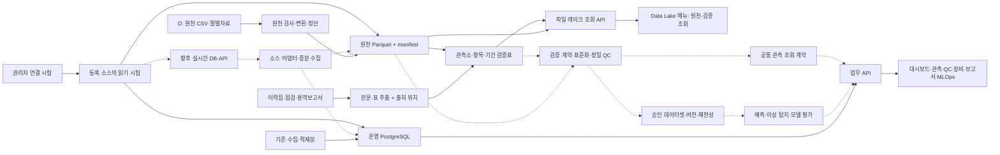

# 2026-10-06 실측 조회 연결 갱신

대시보드·관측 현황·상세는 이제 공통 Parquet 실측 API를 사용합니다. PostgreSQL에는 계보·검증표를 적재했습니다. 관측값 전체 PG 적재와 과거 전체 연결은 미완료입니다. 구현 범위와 최신 검증은 [68_REAL_PARQUET_WEB_CONNECTION.md](68_REAL_PARQUET_WEB_CONNECTION.md)를 참조하세요. 아래 기존 구조 설명은 이전 단계 기록입니다.

# 검증 자료–웹 메뉴–실시간 확장 전체 연관도

2026-10-06. 실제 소스와 로컬 HTTP 응답을 기준으로 작성했다. 실선은 구현된 파일·조회 흐름, 점선은 후속 통합 또는 비활성 수집 경로다. 모든 메뉴가 신규 Parquet를 조회하는 상태는 아니다.

## PostgreSQL 실데이터 재조회에 따른 정정

2026-10-06 읽기 전용 집계에서 앱 접속 대상은 `localhost:5432/ocean_ai_db`였다. `station_metadata`는 323행, `sensor_metadata`는 2행(1개 관측소), `observation_raw`는 13,621행(관측소 코드 10개), `observation_standard`는 4,074행이었다.

**원시 관측 13,621행의 출처는 전부 SIMULATED 표기**다: `MDC_WEB_OBS_VBU_SIMULATED` 12,907행, `MDC_WEB_OBS_ST_SIMULATED` 714행. 따라서 이 DB의 기존 관측값을 실제 MDC 실측 적재 완료분으로 설명해서는 안 된다. `DATA_MODE=live`나 API 200 응답은 자료의 실측성·진위·승인을 입증하지 않는다. `observation_standard` 역시 테이블명이나 `OBS-STD-1.0` 버전만으로 이번 근거 검증을 통과한 표준 자료라고 볼 수 없다.

원시 자료의 DB 저장 `timestamp_kst` 범위는 2026-09-16 00:00:15~2026-09-23 12:10:45이다. 이는 저장 시각 필드의 범위이며 실제 측정기간의 확정이 아니다. 항목은 WAVE 12,906행, TIDE 714행, SALINITY 1행이며 수온은 이 집계에 없다. `UN_0001` 714행은 관측소 등록부와 연결되지 않는다. 신규 D: 실측 Parquet는 이 운영 테이블에 적재된 상태가 아니며 파일 API로 별도 조회한다.

## 현재 구조와 목표 구조

실시간 MDC 자동 동기화는 꺼져 있다. `DATA_MODE=live`는 데모 모드가 아니라는 뜻이며, 실시간 자료 수집 중이라는 증거가 아니다. 기존 PostgreSQL 업무 자료와 이번 D:\share 파일 검증 결과는 출처·처리 범위가 다르다. 새 Parquet를 기존 PostgreSQL 관측 테이블에 전량 삽입하지 않았다.

## 메뉴별 실제 연결

| 메뉴 | 현재 API·저장소 | 신규 Parquet 연동 상태 | 다음 연결 |
|---|---|---|---|
| 종합 대시보드 | `/api/dashboard/*`; PostgreSQL 관측소·관측값·모델 등록부 | 출처 구분 및 Data Lake 링크만 연결 | 선택한 데이터셋의 기간·항목·QC 요약을 별도 집계 |
| 관측 현황·관측소 상세 | `/api/observations/*`, `/api/stations/*`; PostgreSQL | 아직 직접 조회하지 않음 | 공통 조회 API에 원천·관측소·항목·기간 선택 연결 |
| QC | `/api/qc/*`; 원천 상태·규칙·검토 기록 | 파일 QC 결과를 자동 반영하지 않음 | 원천 플래그·재검사·담당 승인별 결과를 분리 연결 |
| AI 분석 인사이트 | `/api/ai-insights/*`; 기존 DB 집계/분석 결과 | 신규 파일 자동 분석 없음 | 승인 범위의 통계·이상 탐지 결과 연결 |
| 장비·운영 | `/api/equipment/status`; 기존 센서·운영 자료 | 문서 기반 사용기간 후보의 완전 연동은 미완료 | 물리 센서–설치/교체–유효기간–관측 구간 연결 |
| 보고서·문서 | `/api/reports/*`, `/api/rag/*`; `report_registry`, `document_index`, 문서 검색 계층 | 신규 근거 전부가 벡터 검색/보고서에 들어간 상태 아님 | 원문 SHA·쪽/표 행·시계열 구간을 보고서 인용으로 연결 |
| 모델 관리 | `/api/mlops/*`; `model_registry`, `retraining_history` | 신규 파일 자동 학습 없음 | `dataset_registry` 승인 버전과 모델 평가를 연결 |
| Data Lake | `/api/data-lake/foundation/*`; D: Parquet + 검증 JSON/SQLite | **신규 99개 현황, 채널 검증표, 원천 제한 조회 구현** | 기존 장기 자료·월별 기준군의 탐색 기능 확장 |
| 조위 예측 기준선 | `/api/forecasting/*`; 기존 DB 관측값 | 신규 파일·학습 모델 연결 아님 | 승인된 예측 데이터셋과 후보 모델 비교 |
| 알림·승인 | `/api/approvals/pending`, `/approve`, `/reject` | 데이터 승인으로 자동 승격하지 않음 | 검토 대상과 근거를 묶어 담당자 승인 |
| 서비스 모니터링 | `/api/service-monitoring/logs`; 운영 로그 | 파일 작업과 통합 모니터링 미완료 | 배치·증분수집 지연/실패/재처리 이력 연계 |
| 시스템·관리자 | `/api/integrations`, `/{source_id}/test` | **DB·Parquet·검증표 읽기 시험 구현** | 소스 등록 UI·스키마 탐색·매핑 검증·수집 관리·시험 이력 |

`ai_reports`는 내부 AI 보고서용 테이블이며 외부 원천 시스템을 의미하지 않는다. 현재 보고서 메뉴의 등록·검토·승인 API는 `report_registry`를 사용한다. 두 테이블을 이름만으로 동일한 등록부로 취급하지 않는다.

## 저장 위치와 현재 범위

| 역할 | 위치 | 사용 방법 |
|---|---|---|
| 원천 | `D:\share` | 읽기 전용 입력; 원본 보존 |
| 기존 통합 레이크 | `D:\AI_Observation\data_lake\spool_2001_2026` | 기존 월별 기준 43개 CSV → 6,149개 Parquet 포함 |
| 추가 월별 레이크 | `D:\AI_Observation\data_lake\share_monthly_2023_2026` | 99개 CSV → 99개 raw.parquet와 프로파일·manifest |
| 파일 검증 실행 | `D:\AI_Observation\outputs\share-validation\latest-run.txt` | 현재 실행 위치 포인터 |
| 검증 버전 | 실행 폴더의 `latest-validation.txt` | `validation.sqlite3`, `channel-validation.json`, Parquet 검증표 |
| 파일 통합 조회 카탈로그 | 검증 버전의 `file-only-timeseries.duckdb` | 원천 4개 그룹을 구분하는 읽기 뷰; 물리적으로 파일을 다시 합치지 않음 |
| 운영 RDB | 로컬 PostgreSQL, 앱 `DATABASE_URL` | 메타데이터·운영 이력·업무 결과·승인·Registry |
| 웹 소스 | `C:\AI_Observation\ocean-ai-platform` | 현재 실행 중인 소스 위치. 소스까지 D:로 옮겼다고 간주하지 않음 |

2026-10-06 20:58 KST 검증표: 기존 관측 형태 행 1,017,630,666 + 추가 행 907,650,042. 합계 1,925,280,708은 **원천별 보유 행의 합계**이며 서로 겹치지 않는 고유 관측 수가 아니다. 전체 6,248개 Parquet가 파일 카탈로그에 등록되었다. 표준화·센서·단위·시간대·QC 승인 완료 건수와는 다르다.

Parquet 활용은 (1) 대용량 원천 보존, (2) 관측소·항목·수층·월별 선택 조회, (3) 결측·중복·기간 프로파일, (4) 버전 고정 데이터셋의 입력이다. 모든 값을 Vector DB에 넣지 않는다. 문서 본문은 검색용 임베딩 대상으로, 관측값은 시계열 분석 대상으로 유지한다.

## 실시간 소스 확장 계약

화면에 DB 테이블명을 직접 하드코딩하지 않고 `source_id + adapter + mapping_version`으로 연결한다. 이번 구현의 연결 시험 어댑터는 운영 SQLAlchemy 엔진, Parquet manifest, 읽기 전용 SQLite이며, 외부 PostgreSQL 읽기 시험을 서버 설정으로 추가할 수 있다. **Oracle·다른 DB·HTTP·메시지 큐 어댑터와 실제 증분 수집기는 후속 구현이다.**

공통 관측 계약에는 다음을 포함해야 한다.

- 원천: `source_id`, 원천 테이블/파일·레코드 식별자, 추출 버전, 원문/파일 해시.
- 식별: 원천 관측소·항목 코드, 표준 코드 대응 상태, 물리 센서 ID와 대응 근거. 미확정 ID는 NULL.
- 시간: 원천 관측시각, 입수시각, 적재시각, 확인된 시간대, 센서 유효 시작/종료, 자료 보유 시작/종료를 분리.
- 값: 원천 값·단위, 승인된 변환 규칙과 표준 값, 수층·수심. NULL·0·결측 대체값을 혼동하지 않음.
- QC: 원천 QC, 재검사 규칙 버전·결과, 문서 근거, 담당 승인 상태를 별도 보존.
- 재현성: 배치/실시간 구분, watermark/checkpoint, 변경·지연 도착·재처리 이력, 승인 데이터셋 버전.

증분 수집은 첫 전체 적재 이후 원천의 변경시각/시퀀스를 기준으로 진행하고, 지연 도착 자료의 재조회 구간을 둔다. 자연키·중복 판정 정책은 원천별 계약으로 확정한다. 시각·센서가 불명확한 자료를 임의 병합하지 않는다. 실패 자료는 별도 격리하고 체크포인트를 성공한 범위까지만 이동한다. 수집 중단과 실제 관측 공백을 다른 상태로 관리한다.

최근 자료의 지연 요구·조회량이 커지면 PostgreSQL 파티션/TimescaleDB 또는 별도 시계열 저장소를 평가하고, 장기 원천은 Parquet로 유지한다. 현재 TimescaleDB 도입이나 외부 Object Storage 배포를 완료한 것은 아니다.

## 관리자 연결 시험

현재 구현:

1. 기존 담당자 인증의 `admin` 역할만 소스 목록·시험에 접근한다.
2. 등록된 운영 DB는 상수 SELECT로 연결·읽기 응답시간을 확인한다.
3. 레이크는 manifest 읽기, 검증표는 읽기 전용 SQLite 조회를 확인한다.
4. 성공/실패·응답시간을 표시한다. 시험만으로 실제 수집·QC 승인·데이터 변경을 시작하지 않는다.
5. 외부 연결 문자열은 서버 환경변수로 보관한다. 브라우저 응답과 오류에 암호·DSN을 반환하지 않는다.

외부 PostgreSQL 설정 형식은 `EXTERNAL_SOURCE_CONNECTIONS`의 소스 ID별 `{label, adapter: sqlalchemy, connection_env}`다. `connection_env`는 별도로 설정한 서버 환경변수 이름을 가리킨다. 비밀값을 이 문서나 Git에 기록하지 않는다. 현재 관리자 인증 `API_IDENTITIES`가 구성되지 않아 실제 관리자 API는 503을 반환한다. 인증을 임의로 해제하지 않았다.

후속 관리자 기능은 등록/수정 UI, 읽기 전용 계정 및 허용 테이블 검증, 스키마 탐색, 표본 컬럼 매핑, 시간대·단위 계약, 증분 조회 시험, 수집 활성화/중지, 로그·체크포인트·재시도 이력이다. 이번 읽기 시험으로 이 기능 전체를 구현했다고 보지 않는다.

## 장애 원인과 복구 검증

- 점검 시 웹/API 포트에 서버가 없었다. FastAPI 8000, Vite 5173을 루프백으로 실행했다.
- Vite 기본 프록시가 8080이었고 백엔드 안내 포트는 8000이었다. 기본 프록시를 8000으로 맞췄다.
- Vite 설정 번들러가 Windows 네이티브 Tailwind 의존성을 읽다 실패했다. Node 24의 Vite `--configLoader native`로 로딩하여 빌드·실행을 검증했다. 개발/빌드/미리보기 스크립트에도 반영했다.
- 알림의 없는 API와 화면상 승인 시뮬레이션을 실제 승인 API 연결로 수정했다. 보고서의 없는 대시보드 API와 필드명 불일치·고정 수치 일부를 수정했다.
- 기본 읽기 API 43개 중 42개 정상, 1개는 운영 모드에서 의도적으로 차단된 데모 기능이었다. 엔티티 ID 필요 경로·인증 경로·MDC 대조 경로는 이 일괄 검사에서 제외했다.
- 프런트 프록시를 통해 대시보드·보고서·승인 대기·레이크 API 응답을 검증했다. 군산항 전기전도도 Parquet 5행을 실제로 읽어 원천 QC·NULL을 보존함을 확인했다.
- 새 API의 NULL/0 보존·해시 불일치 거부·입력 제한·관리자 권한·비밀정보 오류 노출 방지 테스트 6개 통과. 프런트 TypeScript 및 운영 빌드 통과.
- 브라우저 자동 제어는 로컬 샌드박스 디렉터리 권한 오류로 시작하지 못했다. HTTP/프록시/빌드 검증을 실제 화면 렌더링 검증으로 대신 주장하지 않는다. 모든 메뉴의 모든 버튼·승인·AI 실행을 검증한 것은 아니다.
- 확대 문서 작업은 SQLite 잠금으로 중단된 이력을 확인했다. WAL·잠금 대기·실패 상태 기록을 보완하고 기존 원장부터 재개했다. 문서 검토는 계속 진행 중이다.

## 다음 실행 순서

1. 확대 문서 대조를 마무리하고 미검토·연결 불명확·상충·자료 부재를 분리한다.
2. 공통 조회 계약을 구현해 대시보드/관측 메뉴에 원천·기간·검증 상태 선택을 추가한다. 기존 운영 집계와 과거 파일 집계를 분리한다.
3. 확인된 범위부터 표준화·정밀 QC·근거 검토를 통과시켜 승인 Dataset Registry 버전을 만든다.
4. 업무별 모델 평가·문서 검색·보고서 인용 연결을 진행한다.
5. 관리자 인증을 연결하고 추가 실시간 원천의 읽기 시험·매핑 계약·증분 수집 시험을 거쳐 활성화한다.
