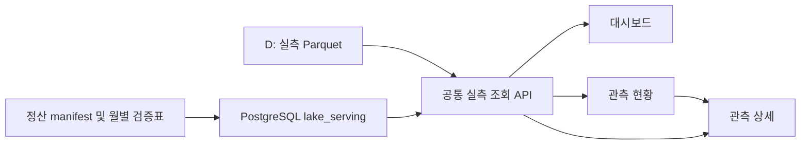

# 실측 Parquet와 웹 조회 연결 — 2026-10-06

> 최신 저장/추진 원칙: [69번 통합 로드맵](69_EXPLAINABLE_AI_FOUNDATION_STATUS_AND_ROADMAP.md). 관측값은 Parquet 중심이며, 전체 PostgreSQL 복제는 다음 단계의 필수 조건에서 제외한다. 아래 전체 PG 적재 미완료 기록은 이전 요청 대비 실제 상태를 남긴 것이다.

## 구현 결과와 범위

대시보드(`/`), 관측 현황(`/observations`), 관측 상세(`/profile/:id`)를
같은 실측 조회 API로 연결했다. 기존 PostgreSQL `observation_raw`의
SIMULATED 관측값을 이 세 화면에서 사용하지 않는다. 기존 자료는 삭제하지 않았다.

기본 선택은 **GD_OBS_ST_MONTHLY, 2023-01~2026-07**이다.
현재 정산 스냅샷 `validation-20261006T115552Z`에서 관측소 코드 93개,
원천 항목 코드 151개, 43개월, 1,017,630,666행을 확인했다.
최초·최종 원천 시각은 2023-01-01 00:00:00~2026-07-30 03:34:00이다.
이 수치는 표준 항목 수·중복 제거 관측 수·QC 유효 수·연속 관측 보장이 아니다.

GD_OBS_BU, GD_OBS_VBU, GR_OBS_ST도 별도로 선택할 수 있다. 추가 원천의
2026년 8~9월은 종료월을 변경해 조회하며, 기본 기준기간에 섞지 않는다.
같은 관측소·항목으로 보여도 원천 또는 수심이 다르면 자동으로 합치지 않는다.

## 저장과 조회 구조



| 저장소/테이블 | 실제 역할 | 현재 상태 |
|---|---|---|
| `lake_serving.snapshot` | 계보·검증표의 불변 버전 및 건수 | 스냅샷 1개 등록 |
| `lake_serving.source_asset` | 원천/Parquet 경로와 해시, 원천 구분 | 6,479개 자산 등록 |
| `lake_serving.channel_month` | 관측소·항목·수심·월별 보유량과 문서/QC 근거 | 66,421건 등록 |
| D: Parquet | 관측시각·실측 원천값·원천 QC의 본체 | API에서 실제 읽음 |
| `public.observation_raw` | 기존 운영 테이블 | SIMULATED 13,621건 보존, 새 세 화면은 참조하지 않음 |

**관측값 전체를 PostgreSQL에 적재한 것은 아니다.** 이번 구현은 PostgreSQL의
계보·검증 기록과 D: Parquet 관측값을 하나의 조회 화면에 연결한 것이다.
앞서 요청된 PostgreSQL 관측값 전체 적재는 별도 미완료 작업으로 남는다.
현재 PostgreSQL 서버의 `data_directory`는 `/var/lib/postgresql/data`이다.
호스트 볼륨 위치는 Docker API 접근 거부로 확인하지 못했다. C: 여유 약 49GiB인
상태에서 10억 행 이상을 기존 볼륨에 무작정 복제하지 않았다. D: 볼륨 위치,
실제 행/인덱스/WAL 용량 산정, 월별 분할 적재·재개 원장이 먼저 필요하다.

## 세 화면의 동작

- 대시보드: 선택 원천·기간의 보유 관측소/항목/행/월 수와 월별 건수 표시.
- 관측 현황: 코드·이름 검색, 관측소별 최초/최종 시각·항목 수·보유 행 수 표시.
- 상세: 목록의 원천·기간을 URL로 유지한다. 항목·수심·월을 선택하면 시간순
  500행 페이지, 원천값 산점도, 원천 QC/MQ, 수신시각, 파일/행/해시를 표시한다.
- 상세 검증표: 관측소 코드, 항목 코드, 원천 동일성, 단위, 센서, 센서 유효기간,
  시간대, QC 근거, QC 승인을 각각 표시한다. 문서 근거·충돌 사유도 펼쳐 본다.
- 보유 건수와 결측값 수는 관측소 가동률 또는 관측 공백 판정으로 바꾸지 않는다.
- 그래프는 현재 페이지의 원천값이며 전체 월 집계가 아니다. 선형 보간하지 않는다.
- 원천시각을 UTC/KST로 추정 변환하지 않는다. 센서·단위·시간대 미확정은 NULL 유지.
- 시각 해석 불가 행은 원천에서 삭제하지 않고 시간순 조회에서만 제외한다.
- API 실패 시 이전 값이나 모의값으로 대체하지 않고 오류를 표시한다.

## 공통 API

| API | 입력/출력 |
|---|---|
| `GET /api/lake/summary` | `source`, `from_month`, `to_month`; 보유량·관측소·월별 집계 |
| `GET /api/lake/stations/{station}` | 같은 원천·기간의 항목/수심/월별 검증과 문서 근거 |
| `GET /api/lake/series` | 원천·월·관측소·항목·수심·limit·offset; 실제 Parquet 관측값 |

집계는 정확히 같은 스냅샷의 PostgreSQL 기록을 사용한다. 아직 발행하지 않은
새 스냅샷은 그 스냅샷의 Parquet 검증표를 사용하고, 이전 PG 버전과 섞지 않는다.
시계열은 원천 그룹과 해당 월의 manifest 등록 파일만 조회한다.
반환 파일의 SHA-256을 확인하며, 파일이 바뀌면 캐시를 무효화한다.
SQL 값은 바인딩하고 경로는 설정 루트 안으로 제한한다. 쿼리는 45초·메모리
512MB·스레드 2개로 제한하며, 중복 시각은 파일명·행번호까지 사용해 순서를 유지한다.

## 과거 자료 제한

`HISTORICAL_RECONCILED`는 `metadata/raw/manifest.json`의 명시적
`raw/reconciled_v1` 자산 231개만 연결한다. 전체 과거 자료의 대체 목록이 아니다.
2011~2021 선택 시 이 작은 등록 범위에서는 2013-01의 원천 관측소 코드 `78`,
3개 항목, 4,314행만 나온다. 이것을 과거 전체 보유량으로 해석하면 안 된다.
`metadata/legacy/manifest.json`은 여전히 HOLD이고 전체 legacy의 원천별
파싱·중복·시간·행 수 정산은 완료되지 않았다. 이 상태를 UI에도 표시한다.
따라서 **2011~2021 모든 관측소의 실측 연결 완료라고 보고하지 않는다.**

## 실행 및 갱신

표준 설치는 `backend/requirements.txt`의 DuckDB 의존성을 포함한다.
현재 컴퓨터는 이미 설치된 `D:\AI_Observation\work\nullable_timeseries\vendor`
DuckDB 1.5.6을 Python 경로에 추가해 실행했다. 이를 재현하는 시작 스크립트:

```powershell
cd C:\AI_Observation\ocean-ai-platform\backend
.\run_local.ps1
```

카탈로그 갱신은 같은 Python 환경에서 `python -m app.scripts.publish_lake_web_catalog`.
같은 스냅샷 재실행은 무변경이며 다른 스냅샷은 별도로 등록한다. 트랜잭션에서
건수를 재확인한 뒤 커밋한다. 이 명령은 관측값의 대량 COPY나 QC 승인을 수행하지 않는다.
MDC 자동 수집은 현재 서버에서 비활성화했다. 향후 실시간 어댑터는 원천 식별자,
관측시각/수신시각/적재시각, 원천 QC와 검토 QC를 보존하며 이 조회 계약을 구현해야 한다.

## 검증 결과

- 소스·기간별 집계, 시각 정렬·페이지 경계, 중복·NULL·0·NaN 원문 보존,
  수심/관측소/월 분리, 해시 불일치·경로 이탈·잘못된 입력 차단 등 10개 테스트 통과.
- TypeScript/Vite production build 통과. 대용량 JS 번들 경고는 남음.
- 실제 5173 프록시에서 세 화면 URL, 집계·상세·실측 API HTTP 200 확인.
- 인천 2023-01 조위, 군산항 2026-07 전기전도도 각 3행을 Parquet 원래 행과
  독립 재읽기해 원천시각·값의 완전 일치 확인.
- UI 자동 렌더링 검증은 샌드박스 `SetNamedSecurityInfoW ... failed: 5` 오류로
  수행하지 못했다. HTTP 성공을 시각/클릭 검증 완료로 간주하지 않는다.
- 기존 구현은 `*Legacy.tsx`로 보존했다. Dashboard는 아래 복원 기록과 같이 기존 레이아웃을 사용하며, Observations도 아래 기록과 같이 기존 레이아웃을 복원했다. StationProfile은 현재 실측·근거 상세 조회 화면을 유지한다.

남은 작업: 전체 과거 자료 정산·조회 확장, PostgreSQL 관측값 전체 적재,
센서·단위·시간대·QC 근거 확정과 담당 승인, UI 시각 검증.


## 2026-10-06 종합 대시보드 기존 화면 복원

사용자 요청에 따라 `DashboardLegacy.tsx`의 지도, 6개 카드, 관측 표, QC 도넛,
AI 알림·최근 보고서·모델 성능 패널의 배치와 크기를 `Dashboard.tsx`에 복원했다.
데이터는 공통 `/api/lake/summary`에서 원천·시작월·종료월 조건으로 조회한다.
관측소 상세 링크에는 동일한 원천과 기간을 전달한다. 검색은 관측소명·코드에 적용한다.
표에는 집계 근거가 있는 보유 행 수와 최종 관측시각을 표시하고 상세 화면에서 원천값을 확인한다.

지도 좌표는 `/api/stations`의 기존 PostgreSQL 기준정보를 관측소 코드로 정확히 대응한다.
복수 코드 대응 또는 좌표 누락은 지도에 임의 배치하지 않으며 관측 표에서는 유지한다.
이 좌표는 운영기간·센서·QC 승인 근거가 아니므로 지도에도 기준정보 참조임을 표시한다.
QC 도넛은 승인 전 원천 행 수이며 정상률이나 통과율이 아니다.
수집률·QC 정상률·BAD 비율은 미산정, AI 이상 탐지는 미연결,
모델 RMSE/F1은 미평가로 표시한다. 기존 고정값 12/8/3.42/0.82를 제거했다.
보고서 패널은 전체 실제 등록부를 조회하고 초안도 포함하며 선택 기간 집계와 구분한다.

복원 후 TypeScript/Vite 빌드 성공, localhost:5173 화면 HTTP 200 및 프록시 API 확인:
93개 관측소, 43개월, 1,017,630,666개 원천 행, 보고서 등록부 0건.
이는 중복 제거된 관측 건수 또는 승인된 학습 데이터 건수를 뜻하지 않는다.
오른쪽 브라우저 패널 열기를 요청했다. 실제 화면 픽셀·클릭 검증은 위 자동화 환경 제한으로 미완료다.


## 2026-10-06 관측현황 기존 화면 복원

`ObservationsLegacy.tsx`의 6개 요약 카드, 좌측 지도·추이 그래프, 우측 관측소 표,
하단 막대·최근 시각·알림 패널을 `Observations.tsx`에 복원했다.
관측값 집계는 대시보드와 같은 `/api/lake/summary`의 원천·기간 조건을 사용한다.
관측소 상세와 대시보드 링크에도 동일 조건을 전달한다.

- 검색, 관측망·해역·상태 필터, 초기화, 수동 새로고침, 선택형 1분/5분 화면 갱신을 연결했다.
- 지도는 동일 관측소 코드의 단일 SQL 기준정보만 참고한다. 누락·복수 대응은 좌표를 추정하지 않는다.
- 기준정보 이름은 원천 관측소명을 덮어쓰지 않는다. Leaflet 마커의 원천 이름은 HTML 이스케이프한다.
- 실제 수신 이력이 없는 정상/지연/중단은 미확정, 수집률·지연 시간은 미산정이다.
- 고정 날짜·전일 증감·알림 12건·관리자 신분 등 확인되지 않은 표시를 제거했다.
- 추이는 월별 보유 원천 행 수다. 미등록 월은 null로 남기고 이어 그리거나 0건으로 단정하지 않는다.
- 하단 막대는 관측소별 보유 항목 수의 상대 크기다. 수집률이 아님을 표시한다.
- 최근 시각은 관측시각이며 수신시각이나 확정된 KST가 아니다.
- 조회 실패·범위 변경 시 이전 원천의 수치를 지우며 모의 데이터로 대체하지 않는다.

TypeScript/Vite production build는 통과했다. 기존 대용량 번들 경고는 남아 있다.
오른쪽 패널의 관측현황 URL 열기를 요청했다.
브라우저 자동 검증은 `helper_sandbox_lock_failed / SetNamedSecurityInfoW failed: 5`로
초기화에 실패하여 픽셀 렌더링·클릭 검증을 완료하지 못했다.

관측현황 HTTP 200, 93개 관측소·43개월·1,017,630,666행과 월별 합계 일치,
2023-01 선택 23,019,694행, 미보유 2030-01 선택 0개소/0행을 확인했다.
2023-01 집계·인천 상세는 동일 검증본 validation-20261006T115552Z를 사용했다.
0행 응답은 등록 자료가 없음을 의미하며 실제 관측 중단을 증명하지 않는다.
